# **BULL & SEA**

Minimal viable product for ecommerce candle and lifestyle product store.

[View live website here](https://p5-bull-and-sea.herokuapp.com/)

<br />


<br />

## [**Table of Contents**](<#table-of-contents>)

<br />

* [**OVERVIEW**](<#overview>)
    * [Site Plan](<#site-plan>)
    * [Database Schema](<#database_schema>)
    * [User Stories & Agile](<#user-stories-and-agile>)
    * [Wireframes](<#wireframes>)
    * [User Interface](<#user-interface>)
    
<br />

* [**SITE FEATURES**](#site-features)
    * [Inherited Code](#inherited-code)
    * [Depreciated Code](#depreciated-code)
    * [Live Code](#live-code)
    * [Landing Page](#landing-page)
    * [Newsletter Signup](#newsletter-signup)
    * [Products Page](#products-page)
    * [Product Details Page](#product-details-page)
    * [Contact Page](#contact-page)
    * [Customer Messages Page](#customer-messages-page)
    * [Allauth Pages](#allauth-pages)
    * [Manage Products Page](#manage-products-page)
    * [Profile Page](#profile-page)
    * [Bag Page](#bag-page)
    * [Checkout Page](#checkout-page)
    * [Checkout Success Page](#checkout-success-page)
    * [Order History Page](#order-history-page)
    * [User Feedback](#user-feedback)

<br />

* [**ROADMAP**](<#roadmap>)

<br />

* [**TECHNOLOGY USED**](<#technology-used>)
    * [Languages](<#languages>)
    * [Installed Libraries In Requirements](<#installed-libraries-in-requirements>)
    * [Other software & resources](<#other-software-libraries-and-resources>)
    * [Testing resources](<#testing-resources>)

<br />

* [**TESTING**](<#testing>)
    * [Fixed Bugs](<#fixed-bugs>)
    * [Known Issues](<#known-issues>)
    * [Manual Testing](<#manual-testing>)
    * [Validation](<#validation>)
    * [Lessons Learned](<#lessons-learned>)

<br />

* [DEPLOYMENT](<#deployment>)

<br />

* [CREDITS](<#credits>)

<br />

* [ACKNOWLEDGEMENTS](<#acknowledgements>)

<br />

# **OVERVIEW**

## **Site Plan**

<br>Fully responsive E-commerce website built using Django & Bootstrap to showcase learning outcomes of Porject 5 for my Code Institute course. The website is for a once-real, but now defunct (due to moving countries), actual business that sold artisan candles. This iteration presumes the business is being restarted and now branching into other lifestyle products.

While technically fake, this may serve as a jumping-off point for a new website for this business or, at the very least, a test bed to ideate from, as we plan to restart the business now that we are settled in Ireland.

The design concept is somewhat in keeping with the original site and the existing but dormant Facebook page. It should be an e-commerce site that focuses on a small inventory of items, with high customer engagement and feedback in the form of a review system and wishlist.

The deployed site represents an MVP which would be iterated on going forward.

<br />

## **Database Schema**

<br>Here you can see the DB Schema plan visually represented. It inherits the core structure of Product, User and Categories from the walkthrough project.
It adds and changes the following models.

* CHANGED MODELS:
  * PRODUCT: Size removed as this was no longer needed for the products featured. The rating field was also removed and FK relationship to our new Review model was added instead.
  * ORDER LINE ITEM: Size removed, again this was no longer required

* NEW MODELS:
  * REVIEW: A model which tracks and stores all product reviews. It accepts a rating and text based review. The latter is not required to allow user to post ratings without needing to leave a comment (this follows practices seen on sites such as booking.com where users can leave blank reviews) It has a foreign key relationship to Product. This allows multiple reviews of one product. In view for this we add a check to prevent users leaving multiple reviews of the same product (more on this later)
  * NEWSLETTER SIGNUP: A model which simply holds a list of emails which can then be used to send a newsletter to. In a live version this would have to have some form of unsubscribe feature built in but for now this is added as a minimum viable feature to show where this could go. I decided to not relate this to users to allow non registered guests to sign up.
  * CONTACT FORM: A model which allows messages sent by customers to be held in a database. As with the newsletter a decision was made to not attach these messages to users as it would prevent non registered guests using this feature. In a live version this feature could be ideated upon and expanded (see roadmap)

<details>
<summary>Schema</summary>


</details>

<br />

## **User Stories and Agile**

A comprehensive Git project page can be found here with my user stories. Overall, I wanted to focus on getting an MVP working, which could be iterated on later or expanded.

I decided not to use sprints or epics since my timescale here was already quite short. I had to go from no code at all to a working project in 5 weeks, so breaking that into smaller chunks felt unnecessary.

In theory, this would be the first step in a much larger and longer process. This version could see a limited release to a test environment (either for clients or trusted testers), and then use feedback to produce new user stories and move forward.

[Project Board](https://github.com/users/JeffreyBull76/projects/6)


<br />

## **Wireframes**

I used an online wireframe tool to create my basic layout idea. It is by no means exhaustive and was ideated in production to what now exists. It provided a good base to work from.

<details>
<summary>BULL AND SEA WIREFRAME PLAN</summary>

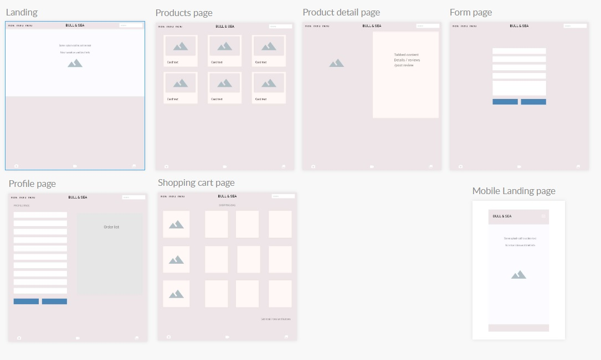

</details>

<br />

### **FINAL SITE STRUCTURE:**
  * The main page structure remains similar to the walkthrough project. It has other templates added where required (such as those for new models)
  * Base page is extended by index which functions as our landing page. In turn the other main template views represented in our navigation are.
      * SHOP - Products > Product Details
      * CONNECT - Contact > Contact Messages (admin feature)
      * MY ACCOUNT - Manage Products (admin feature) > Profile > Allauth account templates
  * I also have a footer (present on all pages) which features the social media linkage.
  * Newsletter signup page - accessed from home page and checkout success page.
  * Bag view page
  * Checkout view page

<br />

<hr>

## **Final Design**

* Font choice here:
    * Cinzel - for main title font and headings
    * Slabo - for all other text

Cinzel was chosen as a more decorative text for main title and Slabo as a still decorative but more readable font for all other text. Both should elicit a craft or artisan feeling without looking to cold or modern.

<br />


<br />

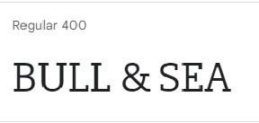

<br />

* Color palette
    * The color palette below was chosen to allow the products to take center stage. A distinct vintage blue and muted grey tones where used to evoke an artisan / vintage feeling.
    * Worth noting some slight variations in tone from these were used where appropriate on elements which were small or needed opacity.


* Hopefully the design feeling conveys artisan high quality products. 

<br />


## **User Interface**

The navigation UI is significantly changed mechanically from the walkthrough, and changed in appearance as well. I now have the title central the search bar off to the far right of the screen and all nav buttons on the left. The shopping bag remains hidden until items are added. 

* ETHOS:
  * All pages are fully responsive in line with modern best practices.
  * I left the structure deliberately unclutttered as this is a small scale business.
  * It should be intuitve to find what you need and not require lots of clicking

* CODE:
  * I am using a dropdown navbar element from Bootstrap to build my navigation, the scripting for which sits in a small function in the postload JS block.


* NAVBAR STRUCTURE:
  * The shop button loads a html template (using includes) that iterates through our two product cateogories.
  This allows for new categories to be added dynamically. And a third static element which goes to an all products view.
  * Contact button is populated with two options: 
    * A connect option to allow users to submit forms to the sites admin. 
    * If an admin is logged in this shows the number of messages requiring attention (or displays a message saying no messages)
  * My account is populated with 2 options for non logged users:
    * Register
    * Login
  * My account is populated with 3 options for logged users:
    * Manage products is displayed if user is an admin that navigates to the relevant page.
    * Profile allows updating and reviewing profile and orders.
    * Logout
  * Search Bar: this sits over to the right and allows searching products by keyword in either title or description. It also allows searching multiple terms at once (changed from walkthrough).
  * Shopping cart: this option only appears to users when items are added to current bag session.

<br />

  * FOOTER ELEMENT:

  

  * The site footer is a consistent component that appears on all pages of the website. It features a standard copyright statement and includes two links to the business's social media profiles: Facebook and Pinterest. These links direct visitors to the official Facebook page and Pinterest page of the business. Although the business is currently not active and the pages are not regularly updated, they remain unchanged from the time of the business's initial launch until it was temporarily put on hold due to relocation. In the event of a relaunch, these pages would require updating with new information and products, but for now, they are presented in their original form.

<br />

<hr>

### [Contents Menu](<#table-of-contents>)

<hr>

<br />

# **SITE FEATURES**

## **Inherited Code**

The navigation UI in this project has undergone significant changes, both mechanically and visually. The codebase for this project inherits the foundational structure and shared code from the walkthrough blog project on the CI course. The models and basic project structure from the previous project served as a starting pointonly. 

Throughout the development process, the codebase was iterated on and substantially extended. However, it is important to acknowledge the shared lineage and the influence of the initial project.

As this is purely an MVP to showcase learning outcomes, at this time I felt it best to stick to the base structure but later in my roadmap section I will note areas this could change further if it were to become a real project.

STRIPE: A special note on the stripe code and integration used. This is unchanged from the walkthrough project. All webhook handling is tested as working on my live code (see testing later)


<br />

## **Depreciated Code**

The code presented below is my custom code that was once part of the repo but since removed following testing.

<br />

<details><summary>Allowed back buttons to retain search categories / keywords</summary>

```
   <td colspan="5" class="text-right">
   
   <a href="{{ request.META.HTTP_REFERER }}"
       class="rating-button btn rounded-2 text-uppercase">
       <span class="icon-pale pr-2">
           <i class="fas fa-chevron-left"></i>
       </span>
       <span class="text-uppercase">Keep Shopping</span>
   </a>
   
   <a href="" class="rating-button btn rounded-2 text-uppercase">
       <span class="icon-pale pr-2">
           <i class="fas fa-chevron-left"></i>
       </span>
       <span class="text-uppercase">Keep Shopping</span>
   </a>
   
```
<br>

* This code was originally a simple and somewhat clumsy solution to having smart back buttons for the search page. The HTTP_REFERER element allowed it to retain search information. However this created issues with back buttons on pages where the previous page was not a product search. So for example if a user navigated to a product, left a review then used the back button it would just return them to the same page they were on. 

* SOLUTION: For now this functionality was removed and all back buttons return to all products view. See roadmap for future solution ideas to this problem.

</details>

<br />

<details><summary>Old search function</summary>

```
def search_products(request):
    query = request.GET.get('q')

    if query:
        products = Product.objects.filter(Q(name__icontains=query) | Q(description__icontains=query))  # noqa
    else:
        products = Product.objects.none()

    context = {
        'products': products,
        'search_query': query
    }

    return render(request, 'products/products.html', context)
```
<br>

* This code was lacking with the site structure I implemented. Searching is now integrated into the `category_products` view and the `search_products` views which handle the two ways our products are retrieved when rendering the products page (as these two views both filter products in slightly different ways)

</details>

<br />

## **Live Code Notes**
I have added extensive annotation to all my Python files (please review where required) in the live code which details its function and how it was built. This of course could be edited down in a production version but it is included here to show what was learned. The various .py files have this throughout. Some of the code which remains unchanged from the walkthrough does not have any annotation added.

Across all forms and elements validation checks are present where appropriate to prevent invalid entries.

<br />

<hr>

## **Landing Page**

Uses the base template extended by index.html and then further extended by the various templates across the site.

### Features

- **Main page**: Displays splash text introducing the store's main product (rapeseed wax candles) and encourages visitors to explore the candle collection and sign up for the newsletter. The page follows the structure defined in the base.html template (which itself has all our dependencies and meta information).
  * Splash text is concise and descriptive and uses strong styling element to highlight the most relevant keywords for the purposes of web crawlers.

### Notes:
- **Future development**: More detail could be added on the front page, such as scrollable content, pleasant inviting animations and video elements and more prominent links to social media sites.

<br />

<details><summary>LANDING PAGE IMAGE</summary>


</details>

<br />

<hr>

## **Newsletter Signup**

This page provides a simple and user-friendly interface for collecting user information and subscribing them to periodic email updates.

### Features

- **Signup Form**: The page displays a signup form where users can enter their email address, to subscribe to the newsletter.
- **Terms and Conditions**: A section displaying the terms and conditions of the newsletter subscription. It outlines important information regarding privacy, content usage, age requirements, and more.
- **Unsubscribe Option**: Users are informed that they can unsubscribe from the newsletter at any time. The page provides an email address where users can send their unsubscribe requests.
- **Responsive Design**: The signup page is designed to be responsive, ensuring optimal viewing and interaction across different devices and screen sizes.

### Notes:
- **Future development**: In a live environment an automated backend integration would be required both for the sending of a newsletter and the unsubscribe feature. I did debate adding a delete address feature but it would serve no purpose in a real world project as it would be open to abuse so its left out here. It could eventually be integrated in the expanded admin messaging panel that could allow the composition of newlsetters in the front end and allow updating and targetting signup list addresses though this would require significantly more testing and development than is possible here.
  * For now it exists as is but its current shortcomings are recognised.

<br />

<details><summary>NEWSLETTER SIGNUP IMAGE</summary>

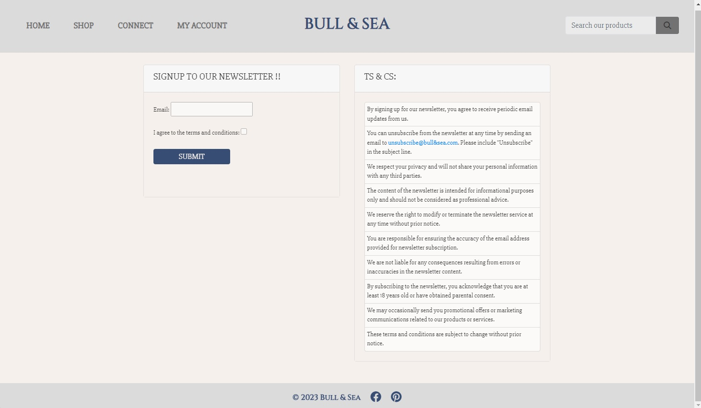

</details>

<br />

<hr>

## **Products Page**

The Product Listing Page renders the product views & provides various features for sorting and presenting products in our database. This page can be accessed from 2 views, either by category or by search term(s). In both cases the sorting works and could be easily extended to provide further functionality.

### Features

- **Product Display**: The page presents a collection of products in a grid layout. Each product is represented as a card with its image, name, price, and category information.
- **Sorting**: Users can sort the products based on price or average rating. The page includes a sorting form with options to select the sorting criteria and direction (ascending or descending). Upon submitting the form, the products are rearranged according to the selected criteria. This sorting works when products 
- **Category Filtering**: If applicable, users can filter the products by a specific category. The page displays a heading indicating the selected category, allowing users to browse products within that category specifically.
- **Search Term Filtering**: If applicable, users can filter the products by a keyword searchs from our nabvar. The page displays a heading indicating the selected search query where applicable.
- **Average Rating**: For products with available reviews, the page calculates and displays the average rating in the form of stars. This allows users to quickly assess the overall quality of each product.
- **Superuser Options**: If the user is a superuser, additional options are provided for editing or deleting products. This functionality enables superusers to manage the product inventory efficiently.
- **Back to Top Button**: A "Back to Top" button is available, allowing users to easily navigate back to the top of the page with a single click.

### Notes:
- **Future development**: In future a way prevent accidental deletion would be required. Either a modal or hidden div could be used which served as a two step deletion process. It is not included here as its relatively simple to add but just adds pointless clicks at a pre-test phase. Following a first deployment to a live testing environment and resultant feedback, a feature such as two step authorization could be added if needed.

<br />

<details><summary>PRODUCTS PAGE IMAGE</summary>

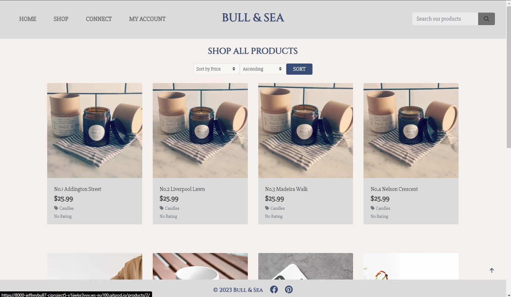

</details>

<br />

<hr>

## **Product Details Page**

The Product Detail Page provides detailed information about a specific product. It allows users to view product details, reviews, and make purchases. The page uses Bootstraps built in tabbed content element. It allows us to have 3 distinct sections (see below) for product details, showing current reviews and showing the form to post reviews.

### Features

- **Product Image**: The page displays an image of the product, allowing users to visually assess its appearance.
- **Tabbed Content**: The page organizes information into tabs, providing easy navigation between different sections such as product details, reviews, and post review.
- **Product Details**: The details tab provides comprehensive information about the product, including its name, price, category, average rating, and description. Users can also find a link to the corresponding category page.
  * This tab allows editing and deletion of products in the same way as the products listing page. As there is may require two step authentication in future.
  * Javascript detailed below
- **Reviews**: The reviews tab displays user reviews for the product. Each review includes the username, rating, and comments. Users can also see whether a review is authorized or awaiting authorization. Superusers and staff members have additional options to authorize or delete reviews.
  * Displays users reviews as card elements, the ratings are applied immediately but the review comments are blocked by default until admins authorise them to prevent malicious content being posted.
  * Admins can authorise with one simple button click from here or from admin panel.
  * Once authorised, users can delete their own reviews from here. Admins can delete anyones review.
- **Post Review**: The post review tab allows authenticated users to submit their own reviews for the product. Users can rate the product and provide comments. If the user has already purchased the product, they will see the review form; otherwise, they will be prompted to log in or register.
  * Has various template checks in place. 
  * First checks for authenticated user (registered and logged in)
  * Secondly checks if a review has already been posted by this user for this product.
  * Third it checks if the user has purchased the product (must be in order history)
  * If all three conditions are met it allows the posting of a rating and comment. The comment is not required to allow users to rate products without leaving a text review. 

### Notes:
- **Future development**: Currently it will still display the review card of blank reviews (to allow for deletion and authorisation) but a better solution could be found in future versions if this proved annoying for test users.

<br />

<details><summary>PRODUCT DETAIL IMAGE</summary>


</details>

<details><summary>REVIEWS TAB IMAGE</summary>

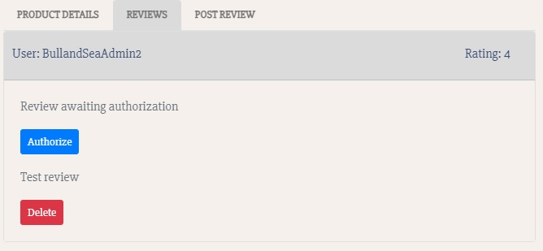

</details>

<details><summary>POST REVIEW TAB IMAGE</summary>

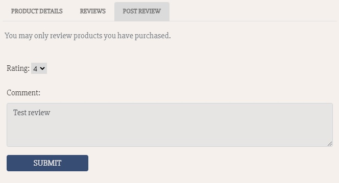

</details>

<br />

### **Javascript Used**:

<details><summary>JS Code Block</summary>

```javascript
// Disable +/- buttons outside 1-99 range
function handleEnableDisable(itemId) {
    var currentValue = parseInt($(`#id_qty_${itemId}`).val());
    var minusDisabled = currentValue < 2;
    var plusDisabled = currentValue > 98;
    $(`#decrement-qty_${itemId}`).prop('disabled', minusDisabled);
    $(`#increment-qty_${itemId}`).prop('disabled', plusDisabled);
}

// Ensure proper enabling/disabling of all inputs on page load
var allQtyInputs = $('.qty_input');
for(var i = 0; i < allQtyInputs.length; i++){
    var itemId = $(allQtyInputs[i]).data('item_id');
    handleEnableDisable(itemId);
}

// Check enable/disable every time the input is changed
$('.qty_input').change(function() {
    var itemId = $(this).data('item_id');
    handleEnableDisable(itemId);
});

// Increment quantity
$('.increment-qty').click(function(e) {
   e.preventDefault();
   var closestInput = $(this).closest('.input-group').find('.qty_input')[0];
   var currentValue = parseInt($(closestInput).val());
   $(closestInput).val(currentValue + 1);
   var itemId = $(this).data('item_id');
   handleEnableDisable(itemId);
});

// Decrement quantity
$('.decrement-qty').click(function(e) {
   e.preventDefault();
   var closestInput = $(this).closest('.input-group').find('.qty_input')[0];
   var currentValue = parseInt($(closestInput).val());
   $(closestInput).val(currentValue - 1);
   var itemId = $(this).data('item_id');
   handleEnableDisable(itemId);
});
```

- The `products/templates/products/includes/quantity_input_script.html` javascript handles the quantity inputs(see above):
1. The `handleEnableDisable` function disables the "+" button if the current quantity is 1 or less, and disables the "-" button if the current quantity is 98 or more.
2. On page load, the code ensures that the proper buttons are enabled or disabled for all quantity inputs.
3. Every time a quantity input is changed, the code checks and adjusts the enable/disable state of the buttons accordingly.
4. The code increments the quantity by 1 when the "+" button is clicked, updates the input value, and adjusts the enable/disable state.
5. The code decrements the quantity by 1 when the "-" button is clicked, updates the input value, and adjusts the enable/disable state.

</details>

<br />

<hr>

## **Contact Page**

The Contact Page allows users to get in touch with the website administrators / owners. It provides a convenient and user-friendly interface for users to send inquiries, feedback, or any other messages. All contact form enquiries are saved to the database to prevent loss of data and allow for future functionality and cross app features.

### Features

- **Contact Form**: The page includes a contact form where users can enter their information, such as name, email, phone number, and message. 
- **User-Friendly Interface**: The contact form is designed to be intuitive and easy to use, ensuring a smooth experience for users when submitting their inquiries.
- **Validation and Error Handling**: The form includes validation checks to ensure that required fields are filled out correctly. If there are any errors or missing information, appropriate error messages are displayed to guide users in correcting their input.
- **Responsive Design**: A decision was taken to not link contact form entries to a specific user or user profile, as this would prevent non registered users from accessing this.

### Notes:
- **Future development**: In future more checks could be added so it still allowed non registered access, but also tracked contact forms sent by registered users and linked them to their profile.

<br />

<details><summary>CONTACT PAGE IMAGE</summary>

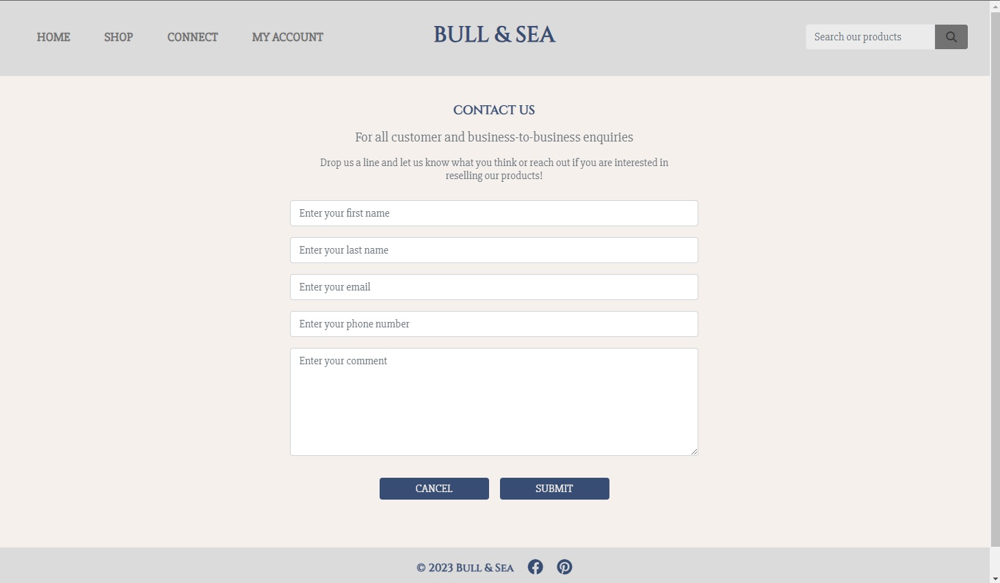

</details>

<br />

<hr>

## **Contact Messages Page**

The Contact Messages Page displays messages submitted through the contact form. It serves as a front end page for managing customer and business-to-business inquiries that require attention. The page provides an organized view of the contact messages, allowing administrators to review and take necessary actions.

### Features

- **Message Overview**: The page provides an overview of contact messages, including the first name, last name, email, phone number, comment, and creation timestamp for each message.
- **Attention Indicator**: Administrators can quickly identify new messages that require attention through an attention indicator. The page displays the count of new messages that need to be reviewed.
- **Delete Functionality**: Superusers have the option to delete messages directly from the page. A delete button is provided for each message, enabling efficient management of messages.

### Notes:
- **Future development**: This page is mostly included as a first proof of concept for a larger in app messaging / contact system. It would require 1 or more of the following to going forward.
  * Track new and old messages: This could be done relatively simply if this feature proved useful. It would mean admins could flag messages as 'read' without deleting them meaning they would no longer show as new messages but still remained to be interacted with. They could then be rendered on a separate page (archived messages) so data was retained but they didn't clog up the page.
  * Allow front end form creation for admins to answer messages from this page. A message could be selected which navigated to a reply form that if hooked up the backend correctly could send an email directly from the this page without requiring separate emails to be sent.
  * If users and user profiles were hooked up to this feature it would allow querying of orders and other such functionality.

<br />

<details><summary>CONTACT MESSAGES PAGE IMAGE</summary>

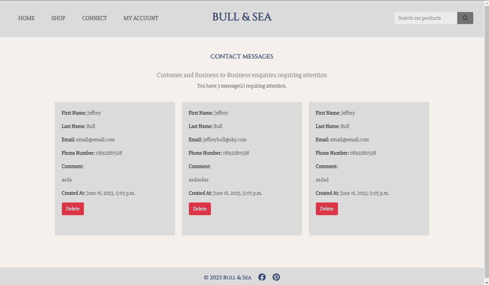

</details>

<br />

<hr>

## **Allauth Pages**

The Base Allauth template is used as a foundation for other urls within the website. It provides a consistent structure and layout for the pages while allowing customization of specific content sections.

### Features

- **User Menu**: The menu section provides options for user authentication. If the user is authenticated, they can access actions like changing their email or signing out. If the user is not authenticated, options for signing in or signing up are available.
  * Users can login, logout, register and so on from here, it uses Allauths templates but customised to suit the project

<br />

<details><summary>ALLAUTH PAGE IMAGE</summary>

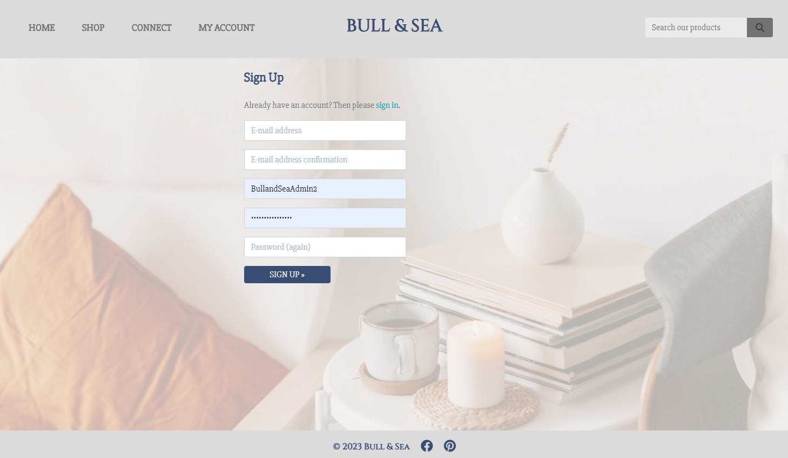

</details>

<br />

<hr>

## **Manage Products Page**

### Add Product Page

The Add Product Page allows admins to add new products to the website's product inventory. It provides a user-friendly interface for entering product details and uploading an associated image. The page is designed to streamline the product addition process and ensure accurate information for each new product.

### Features

- **Product Form**: The Add Product Page includes a form where users can enter the details of the new product. The form includes fields for various attributes, such as product name, price, description, and category. The form is designed using the Django Crispy Forms library, which enhances form rendering and validation.
- **Image Upload**: Users can select an image file to associate with the new product. The page includes an image upload field that allows users to choose an image file from their local device. The selected image file name is displayed dynamically to provide visual feedback.
  * The widget used here is the same as the walkthrough project.
- **Form Submission**: Upon completing the product details and uploading the image, users can submit the form. The form data is sent via a POST request to the server, where it is processed and saved to the database. Successful submission redirects the user to the products page, allowing them to view the newly added product in the inventory.

### Edit products page

Is broadly similar but simply allows editing of existing products rather than adding new ones.

### Notes:
- **Future development**: Integrate a way to autoupload images to AWS on form submission (currently manually uploading the image is required)

<br />

<details><summary>MANAGE PRODUCTS IMAGE</summary>

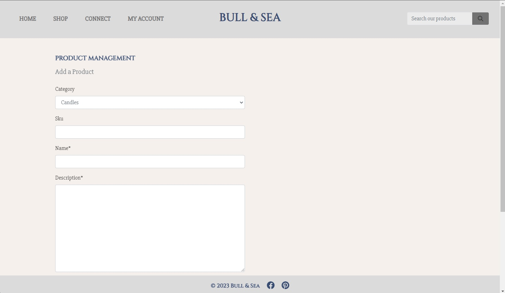

</details>

<br />

<hr>

## **Profile Page**

The Profile Page provides users with access to their account information and order history. It allows users to view and update their default delivery information and review their past orders. The page is designed to be user-friendly and responsive.

### Features

- **Default Delivery Information**: Users can view their default delivery information, such as name, address, and contact details, conveniently displayed on the page.
- **Update Information**: A form is provided for users to update their default delivery information. The form is pre-populated with the existing data and includes fields for users to make changes. Upon submitting the form, the updated information is saved to the database (form validation is present)
- **Order History**: Users can access a table displaying their order history. Each order entry includes the order number, date, items purchased, and the total order amount.
- **Order Details**: By clicking on the order number, users can navigate to a detailed view of a specific order. This view provides additional information about the order, including individual products purchased and their quantities.
- **Post-load JavaScript**: Additional JavaScript functionality is included at the end of the page for handling country fields. The JavaScript file "countryfield.js" is loaded for this purpose.

### Notes:
- **Future development**: In future as mentioned earlier, greater integration with the messaging system could be put in place. Allowing users to perform some tasks from within their profile, such as messaging site admins, unsubscribing to the newsletter etc.

<br />

<details><summary>PROFILE PAGE IMAGE</summary>

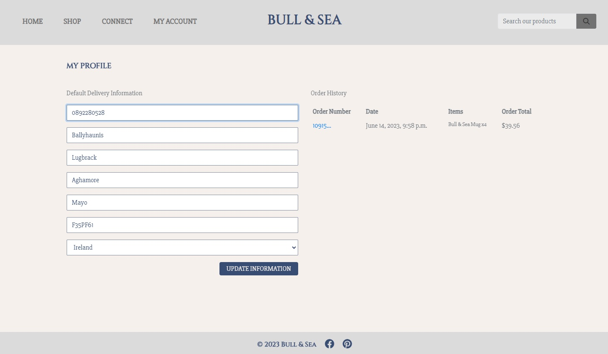

</details>

<br />

<hr>

## **Shopping Bag Page**

The Shopping Bag page allows users to view the items they have added to their bag while shopping on the website. It provides an overview of the items, their prices, quantities, and subtotal amounts. Users can adjust the quantities of items, remove items from the bag, and proceed to secure checkout. 

### Features

- **Table Overview**: The page displays a table with a detailed overview of the items in the shopping bag. Each row represents an individual item and includes the item's image, name, price, quantity, and subtotal amount.
- **Update Quantity**: Users can update the quantity of each item by adjusting the corresponding input field. The quantity update is performed using an increment and decrement functionality.
- **Remove Item**: Users can remove an item from the shopping bag by clicking the "Remove" link next to the item. The page automatically updates to reflect the changes.
- **Bag Total**: The page displays the total price of the items in the bag, including the subtotal and delivery charges (if applicable). The grand total, which includes the bag total and delivery charges, is also shown.
- **Navigation Buttons**: Users can navigate back to the product listing page to continue shopping or proceed to the secure checkout page using the provided navigation buttons.

### Javascript used

- This JavaScript code loaded from `quantity_input_script.html`used earlier in the product details page.
- This code handles the functionality of updating the quantity of an item and removing an item from the shopping bag in this template.

<details><summary>JS Code Block</summary>

```// Update quantity on click
    $('.update-link').click(function(e) {
        var form = $(this).prev('.update-form');
        form.submit();
    });

    // Remove item and reload on click
    $('.remove-item').click(function(e) {
        var csrfToken = "{{ csrf_token }}";
        var itemId = $(this).attr('id').split('remove_')[1];
        var url = `/bag/remove/${itemId}/`;
        var data = {'csrfmiddlewaretoken': csrfToken};

        $.post(url, data)
         .done(function() {
             location.reload();
         });
    });
  ```

1. The `$('.update-link').click(...)` function is triggered when the "Update" link is clicked. It selects the corresponding form element and submits it, triggering the form submission action.
2. The `$('.remove-item').click(...)` function is triggered when the "Remove" link is clicked. It retrieves the necessary information such as the CSRF token and the item ID from the HTML attributes. Then, it sends a POST request to the specified URL with the data. If the request is successful, it reloads the page.

</details>

<br />

<details><summary>BAG PAGE IMAGE</summary>

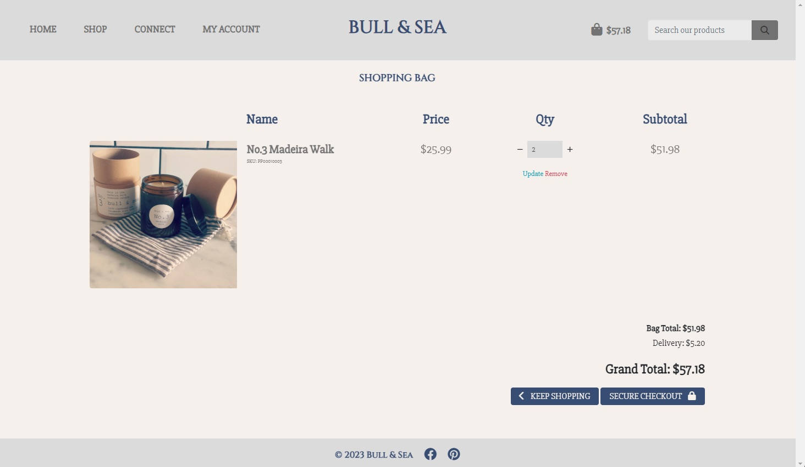

</details>

<br />

<hr>

## **Checkout Page**

The Checkout Page where users can complete their orders by providing necessary details and making payments.

### Features

- **Order Summary**: The Checkout Page displays a summary of the user's order, including the number of items in the order and the total order amount. Each item in the order is listed, showing the item's name, size (if applicable), quantity, and subtotal.
- **Form for Order Completion**: Users are presented with a form to fill out their details for order completion. The form includes fields for the user's full name, email, phone number, delivery address (street address, town/city, county, and postcode), and country.
- **Saving Delivery Information**: If the user is authenticated, they have the option to save their delivery information to their profile by checking the "Save this delivery information to my profile" checkbox.
- **Payment**: The Checkout Page includes a payment section where users can enter their payment information. It utilizes Stripe as the payment gateway, providing a secure and seamless payment experience.
- **Navigation**: Users have the ability to adjust their bag and return to the previous page by clicking the "Adjust Bag" button. They can also complete their order by clicking the "Complete Order" button.

### JavaScript Functionality

- **Stripe Elements**: The page includes the necessary JavaScript code to integrate Stripe Elements for handling the payment section. It sets up the Stripe card element and displays any form errors or validation messages to the user.
- **Loading Overlay**: A loading overlay is displayed while the page is processing information or waiting for a response. It provides visual feedback to the user, indicating that the page is working on their request.

### Notes:
- **Future development**: Full site would require setup so actual order fulfilment, stock tracking and payments were processed (beyond scope of this project)

<br />

<details><summary>CHECKOUT PAGE IMAGE</summary>

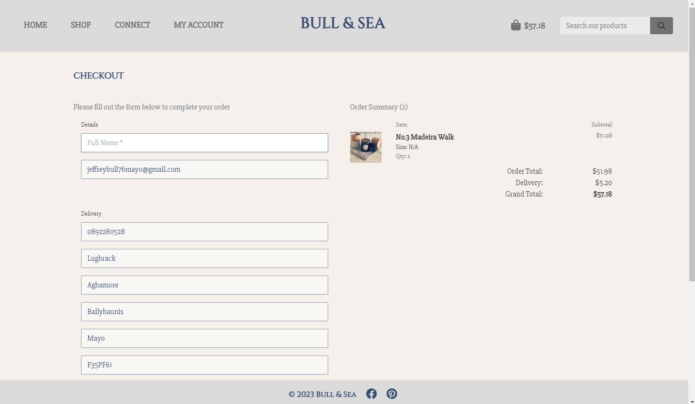

</details>

<br />

<hr>

### **Checkout Success Page**

The checkout success page is displayed to users after they have successfully placed an order. This Markdown readme description provides an overview of the Order Confirmation Page and its features.

## Features

- **Order Information**: The page displays the order details, including the order number, order date, and order items. Each item in the order is listed, showing the product name, quantity, and individual price.
- **Delivery Information**: The page also presents the delivery information provided by the user during the checkout process. This includes the user's full name, address details (street address, city/town, county, postal code), country, and phone number.
- **Billing Information**: The order's billing information is displayed, including the order total, delivery cost, and grand total.
- **Navigation**: Users can navigate back to their profile page or the home page, depending on their context. The appropriate navigation link is displayed based on whether the user accessed the page from their profile or directly from the checkout process.
- **Newsletter Subscription**: Users are provided with an option to sign up for the newsletter by clicking the "Sign up to our newsletter" button. This integration allows users to stay updated with the latest offers and promotions.

### Notes:
- **Future development**: This could in theory be integrated into the proposed internal messaging system so users could attach notes to their deliveries. So for example if they wanted special delivery notes added or wrapped as a gift for somebody (etc)

<br />

<details><summary>CHECKOUT SUCCESS PAGE IMAGE</summary>

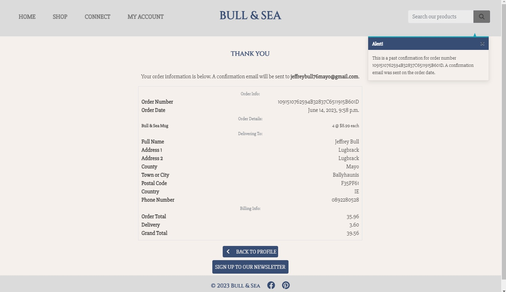

</details>

<br />

<hr>

### **Order History View**

The same as the previous checkout success page, but called by clicking on order number within a users profile (see image below)

### Notes:
- **Future development**: This could in theory be integrated into the proposed internal messaging system so users could receive updates on their order, raise queries or complaints directly from within the app.
  * Could also have repeat order functionality added to allow easily repeating an order.

<br />

<details><summary>ORDER HISORY VIEW IMAGE</summary>

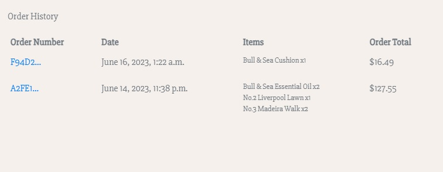

</details>

<br />

<hr>

## **STRIPE NOTES**

The Stripe payment system has been integrated into the site to provide a secure payment processing solution. 

### MVP Implementation and Webhooks

It's important to emphasize that the current implementation of Stripe's payment system in this project is focused on MVP functionality and does not include full payment processing capabilities. The primary purpose is to enable user testing and evaluate the integration of webhooks.

Webhooks play a crucial role in this MVP implementation. They are endpoints that allow Stripe to send real-time notifications to your application regarding specific payment events. By leveraging webhooks, you can track and respond to events such as successful payments, failed charges, and subscription updates, it also prevents user errors like double inputs or orders and so on.

Please keep in mind that while the current implementation may not process actual payments, it serves as a foundation for future enhancements. In future development full integration with the API could be coded to allow actual payments to be made.

<br />

<hr>

### [Contents Menu](<#table-of-contents>)

<hr>

# **ROADMAP**

- **CONTACT FORM EXPANSION**: For now, this remains a proof of concept for what could become an internal messaging system for admins to answer customer inquiries. In theory, it could be expanded to allow the adding of different types of contact (such as business-to-business, complaints, etc.). Whether this proves a worthwhile use of development time would need to be judged after a test deploy and extensive user feedback. As detailed in various sections above, this could be integrated across many different features to allow users and admins to communicate more easily within the app.

- **DYNAMIC BACK BUTTONS**: This feature aims to enhance the navigation experience by implementing dynamic back buttons that adapt to the user's browsing history. It would allow users to conveniently navigate back to the previous page they visited, improving overall usability.

- **WISHLIST SYSTEM**: The wishlist system will enable users to save their favorite products for future reference or potential purchase. Users will be able to add items to their wishlist, view and manage the wishlist, and receive notifications for changes in availability or discounts on wishlisted items.

- **SALE / OFFERS SYSTEM**: This feature aims to implement a sale/offers system to provide special discounts and promotions to users. It will enable the display of discounted prices, limited-time offers, promotional codes, or bundle deals, enhancing the user's shopping experience and encouraging increased sales.

- **DELETE CONFIRMATION SYSTEM**: Working from feedback from the current MVP, a delete confirmation pop-up may be added to enhance user experience and prevent accidental deletion of important data. This system will prompt users to confirm their action before permanently deleting any content. I left this out for now as I felt implementing it then removing represented bad coding practice. Rather it was better to ommit now and add later if required in a live version.

- **EXPANDED TAG LIST AND INTEGRATION**: This feature involves expanding the existing tag list and integrating it more comprehensively throughout the application. It will enhance product categorization, filtering, and search functionality, making it easier for users to find specific products based on their interests or preferences.

- **MORE IMAGES ON PRODUCTS**: This feature aims to enhance product representation by allowing the addition of multiple images per product. It will provide users with a more comprehensive visual understanding of the products, potentially increasing engagement and conversion rates.

<br />

<hr>

### [Contents Menu](<#table-of-contents>)

<hr>

## **TECHNOLOGY USED**
EDIT THIS

## **Languages**
  * [HTML](https://www.w3.org/standards/webdesign/htmlcss) - Base structure
  * [CSS](https://www.w3.org/standards/webdesign/htmlcss) - Style elements
  * [Javascript](https://developer.mozilla.org/en-US/docs/Web/javascript) - Some interactive elements
  * [Python](https://www.python.org/) - Backend functionality

<br />

EDIT THIS
## **Installed libraries in Requirements**
  * [asgiref](https://pypi.org/project/asgiref/)
  * [cloudinary](https://pypi.org/project/cloudinary/)
  * [dj-database-url](https://pypi.org/project/dj-database-url/)
  * [dj3-cloudinary-storage](https://pypi.org/project/dj3-cloudinary-storage/)
  * [Django](https://pypi.org/project/Django/)
  * [django-allauth](https://pypi.org/project/django-allauth/)
  * [django-crispy-forms](https://pypi.org/project/django-crispy-forms/)
  * [django-summernote](https://pypi.org/project/django-summernote/)
  * [gunicorn](https://pypi.org/project/gunicorn/)
  * [oauthlib](https://pypi.org/project/oauthlib/)
  * [Pillow](https://pypi.org/project/Pillow/)
  * [psycopg2](https://pypi.org/project/psycopg2/)
  * [PyJWT](https://pypi.org/project/PyJWT/)
  * [python3-openid](https://pypi.org/project/python3-openid/)
  * [pytz](https://pypi.org/project/pytz/)
  * [requests-oauhlib](https://pypi.org/project/requests-oauthlib/)
  * [sqlparse](https://pypi.org/project/sqlparse/)

<br />

EDIT THIS
## **Other software, libraries and resources**
  * [Bootstrap](https://getbootstrap.com/) - used for base style elements and layout
  * [Font Awesome](https://fontawesome.com/) - used for landing page icons
  * [Jquery](https://cdnjs.com/libraries/jquery) - used throughout the site
  * [Popper JS](https://cdnjs.com/libraries/popper.js) - Library used in forms.py
  * [Django](https://www.djangoproject.com/) - A model-view-template framework used to create the Review | Alliance site
  * [Fluid UI](https://www.fluidui.com/) - Wireframe resource
  * [Github](https://github.com/) - Used to host this repository
  * [Gitpod](https://www.gitpod.io) - Used to edit and push to the repo, the native validator was used to validate all Python code.
  * [Heroku](https://id.heroku.com/login) - Cloud platform the live site is deployed to
  * [Favicon](https://favicon.io/) - Used to create favicon
  * [Cloudinary](https://cloudinary.com/) - Hosts all static files in the project and user images
  * [LINK](https://www.youtube.com/watch?v=2IbRtjez6ag) - Link to a lesson that showed how to create a simple Intersection observer script, which was extended for my project
  * [LINK](https://www.w3resource.com/html-css-exercise/html-css-practical-exercises/html-css-practical-exercise-40.php) - Gallery code was taken from here then edited for use.
  * [LINK](http://animista.net) - Used to create the bounce button effect and slide-up image animation

<br />

EDIT THIS
## **Testing resources**
  * [HTML Validation](https://validator.w3.org/) - Used to validate HTML code
  * [CSS Validation](https://jigsaw.w3.org/css-validator/) - Used to validate CSS code
  * [JSHint Validation](https://jshint.com/) - Used to validate JavaScript code
  * [PyCodeStyle](https://pypi.org/project/pycodestyle/) - Used to validate all python code
  * [Lighthouse](https://developer.chrome.com/docs/lighthouse/overview/) - Performance testing resource
  * [Responsive Design Checker](https://www.responsivedesignchecker.com/) - Used for responsiveness check
  * [Google Chrome DevTools](https://developer.chrome.com/docs/devtools/) - Used throughout the project to debug and test
  * [Wave Web Accessibility Evaluation Tool](https://wave.webaim.org/) - Used to validate the site's accessibility

<br />

<br />

<hr>

### [Contents Menu](<#table-of-contents>)

<hr>

## **TESTING**

## **Fixed Bugs**
* Text here

<br />

## **Known Issues**

Text here

<br />

## **Manual Testing**
All user stories marked as 'done' on our project board [HERE](board-link-here) were tested and signed off.

<br />

I did not have time to implement automated or unit tests. As the project is relatively straightforward I opted for manual testing. The results can be seen below.


!! EDIT THIS TO BE RELEVANT TO PROJECT 5 !!

| Status | **Landing Page** |
|:-------:|:--------|
| &check; | Custom 404 page exists and shows when the user manually enters an incorrect address extension |
| &check; | Clicking the title reloads to index.html landing page when not logged in |
| &check; | All landing page links navigate to the correct pages |
| &check; | All landing page modals open the correct panels |
| &check; | The landing page responds to different screen sizes correctly |
| &check; | Using the signup link work correctly and redirects to the gallery page |
| &check; | Using the login link work correctly and redirects to the gallery page |
| &check; | All scripts and resources load correctly |
| &check; | The footer at the bottom shows correctly and the modal works |

<br />

| Status | **Gallery Page**
|:-------:|:--------|
| &check; | Custom 404 page exists and shows when the user manually enters an incorrect address extension |
| &check; | The Gallery page only shows for logged users, it is unreachable otherwise |
| &check; | The Gallery page loads the post cards in a dynamic masonry gallery correctly |
| &check; | On scroll new images become visible correctly using an intersection observer API |
| &check; | The Main navigation links change to show account access and logout once signed in |
| &check; | The Gallery navigation bar shows correctly once the user is logged in |
| &check; | Gallery navigation bar links work correctly and redirect to the main gallery and submission form respectively |
| &check; | Clicking the title when logged in correctly redirects to the gallery |
| &check; | On new posts do not show in the gallery until published by superuser/staff |
| &check; | Hovering over an image on desktop systems correctly fades in the image title, likes, and comments counters |
| &check; | The hover function is correctly disabled on mobile and tablets |
| &check; | All navigation links work correctly from the gallery page |
| &check; | Clicking an image card takes you to the correct post details page |
| &check; | The footer at the bottom shows correctly and the modal works |

<br />

| Status | **Post Detail Page**
|:-------:|:--------|
| &check; | Custom 404 page exists and shows when the user manually enters an incorrect address extension |
| &check; | Post details page only shows for logged users | 
| &check; | On entering the page our view renders the post details and its relevant parameters to the fields | 
| &cross; | Post detail page is bug-free (see known issues) |
| &check; | All navigation links work correctly from this page |
| &check; | Below the image the likes and comments counter appears correctly |
| &check; | Clicking the like button toggles the like status for the current user |
| &check; | A comment box form loads at the bottom of the page allowing users to post comments |
| &check; | Posted comments render to the bottom left and correctly display a 'delete' button to the comment author |
| &check; | Posting a comment automatically refreshes the page and reverse redirects |
| &check; | The post text fields correctly allow for one-button copying to the clipboard via a script |
| &check; | The footer at the bottom shows correctly and the modal works |

<br />

| Status | **Submit Post Page**
|:-------:|:--------|
| &check; | Custom 404 page exists and shows when the user manually enters an incorrect address extension |
| &check; | All navigation links work correctly from this page |
| &check; | Submit post page only shows for logged users | 
| &check; | On entering the page the instructions panel shows correctly on all screen sizes | 
| &check; | On entering the page our submission form renders correctly based on our Post model |
| &check; | All form fields are error checked to prevent empty submissions |
| &check; | On error correctly flags page as posted to prevent form clearly and redirects to self |
| &check; | The title field checks for a unique name and correctly slugifies this data |
| &check; | The form automatically detects the logged user and attaches their details to the submitted data |
| &check; | The image field has a check in place to prevent data over 1MB from being submitted (temporary solution) |
| &check; | Clicking submit correctly commits the data to the database and sends the image to Cloudinary |
| &check; | Submitting data correctly redirects users back to the gallery page |
| &check; | The footer at the bottom shows correctly and the modal works |

<br />

| Status | **Update Post Page**
|:-------:|:--------|
| &check; | Custom 404 page exists and shows when the user manually enters an incorrect address extension |
| &check; | All navigation links work correctly from this page |
| &check; | update post page only accessible for logged users | 
| &check; | On entering the page form renders with the same formatting as post view page |
| &check; | All form fields are Pre-populated with existing post details |
| &check; | All form fields are error checked to prevent empty submissions |
| &check; | When an error is encountered redirects the user to the current page |
| &check; | Submitting data correctly redirects users back to the account page |
| &check; | The footer at the bottom shows correctly and the modal works |

<br />

| Status | **Account Page**
|:-------:|:--------|
| &check; | Custom 404 page exists and shows when the user manually enters an incorrect address extension |
| &check; | All navigation links work correctly from this page |
| &check; | Account page only shows for logged users and shows their names correctly | 
| &check; | Account page shows an admin button for superusers/staff only, allowing for easy navigation to the admin panel |
| &check; | Correctly populates a list of draft posts for superusers/staff and allows for one-button publishing |
| &check; | Correctly populates a list of user's own posts and allows for one-button updating and deletion |
| &check; | All deletion and update actions require confirmation on request and show flash messages |
| &check; | All redirects work conditionally to redirect to the account page |
| &check; | Post deletion process also removes the image from Cloudinary |
| &check; | All dynamic load animations for the gallery are removed from the account page|
| &check; | The footer at the bottom shows correctly and the modal works |

<br />

| Status | **Admin Page**
|:-------:|:--------|
| &check; | Custom 404 page exists and shows when the user manually enters an incorrect address extension |
| &check; | All standard admin functionality is available | 
| &check; | Extra function to allow mass publishing from dropdown present and working |
| &check; | All form data is admissable from the Admin panel in line with the model |
| &check; | Users are able to navigate back to the site easily |

<br />

## **Validation**

  **HTML validation:**
  All code was manually fed into the validator. Various duplicate ID errors and missing alt tags were fixed. 
  Now returns no errors on all pages.

  <details><summary>HTML Validation</summary>

  HTML validation:

  

  <br />

  </details>

  <br />

  **CSS validation:**
  All code was manually fed into the validator. Returns no errors.

  <details><summary>CSS Validation</summary>

  CSS validation:

  

  <br />

  </details>
  
  <br />

  **Javascript validation:**
  JS testing output here
  
  <details><summary>JS Validation</summary>

  Account page:

  

  <br />

  </details>
  
  <br />

  **Lighthouse testing:**

  Test data here

  <br />

  **Wave web accessibility test:**

  Testing output here

  <details><summary>Wave web test</summary>

  Wave web test:

  

  <br />

  </details>

<br />

## **Lessons Learned**
  * Text here

<br />

--------------------------------------------------------

### [Contents Menu](<#table-of-contents>)
--------------------------------------------------------

EDIT THIS
## **DEPLOYMENT**

* Code was written in Gitpod by creating a repo from the initial CI full template [HERE](https://github.com/Code-Institute-Org/gitpod-full-template)
* ### Forking the repository
  * A copy of the GitHub Repository can be made by forking the GitHub account. This copy can be viewed and changes can be made to the copy without affecting the original repository. Take the following steps to fork the repository;
  * Log in to GitHub and locate the repository.
  * On the right-hand side of the page in line with the repository name is a button called 'Fork', click on the button to create a copy of the original repository in your GitHub Account.

<br />

* ### Cloning the repository
  * Under the repo’s name, click on the code tab.
  * In the Clone with HTTPS section, click on the clipboard icon to copy the given URL.
  * In your IDE of choice, open Git Bash.
  * Change the current working directory to the location where you want the cloned directory to be made.
  * Type git clone, and then paste the URL copied from GitHub.
  * Press enter and the local clone will be created.

<br />

* ### Deploying to Heroku
  * Create working Procfile
  * Ensure requirements.txt is up to date with pip freeze --local > requirement.txt - Vital so that Heroku knows what packages and dependencies are being used.
  * In our env.py files we use 'noqa' to stop error for long line, this was ok to leave as it not deployed to Heroku.
  * An ignore file is used with an env.py file to prevent secure data from being published to git.
  * Make sure to set debug to "DEBUG = 'DEVELOPMENT' in os.environ" so that Heroku will not run in debug mode.
  * Make sure the current working branch is up to date and pushed to GitHub correctly.
  * Login to Heroku using 2 step authentication.
  * Once logged create a new app in Heroku.
  * Set the config vars of the new app in heroku to reflect the dependencies in the app (see below).
  * Link the app to our GitHub repo (see below).
  * This was then deployed manually to ensure control over the live version.
  * You do this by navigating to the deploy tab and selecting manual or automatic.
  * Check the build log for a successful build.

<details><summary>Config Vars redacted</summary>


</details>

<br />

<details><summary>Link repo</summary>


</details>

<br />
 
<hr>

### [Contents Menu](<#table-of-contents>)

<hr>

## **CREDITS**

Text here

<hr>

### [Contents Menu](<#table-of-contents>)

<hr>

## **ACKNOWLEDGEMENTS**

Text here

<hr>

### [Contents Menu](<#table-of-contents>)

<hr>