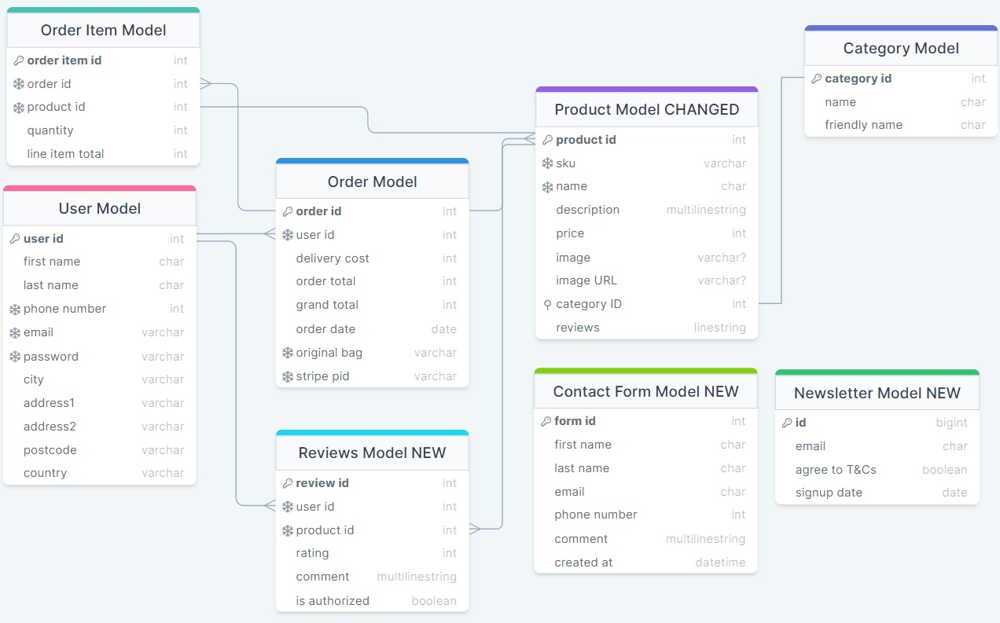

# **BULL & SEA**

Minimal viable product for ecommerce candle and lifestyle product store.

[View live website here](https://p5-bull-and-sea.herokuapp.com/)

 

 

## [**Table of Contents**](<#table-of-contents>)

 

* [**OVERVIEW**](<#overview>)
    * [Site Plan](<#site-plan>)
    * [Database Schema](<#database_schema>)
    * [User Stories & Agile](<#user-stories-and-agile>)
    * [Wireframes](<#wireframes>)
    * [User Interface](<#user-interface>)
    
 

* [**SITE FEATURES**](<#site-features>)
    * [Inherited Code](<#inherited-code>)
    * [Depreciated Code](<#depreciated-code>)
    * [page 1](<#page-1>)
    * [User Feedback](<#user-feedback>)

 

* [**ROADMAP**](<#roadmap>)

 

* [**TECHNOLOGY USED**](<#technology-used>)
    * [Languages](<#languages>)
    * [Installed Libraries In Requirements](<#installed-libraries-in-requirements>)
    * [Other software & resources](<#other-software-libraries-and-resources>)
    * [Testing resources](<#testing-resources>)

 

* [**TESTING**](<#testing>)
    * [Fixed Bugs](<#fixed-bugs>)
    * [Known Issues](<#known-issues>)
    * [Manual Testing](<#manual-testing>)
    * [Validation](<#validation>)
    * [Lessons Learned](<#lessons-learned>)

 

* [DEPLOYMENT](<#deployment>)
 

* [CREDITS](<#credits>)
 

* [ACKNOWLEDGEMENTS](<#acknowledgements>)
 

--------------------------------------------------------
## **OVERVIEW**

### **Site Plan**
 E-commerce website built using Django to showcase learning outcomes from my Code Institute course. The website is for a once-real, but now defunct (due to moving countries), actual business that sold artisan candles. This iteration presumes the business is being restarted and now branching into other lifestyle products.

While technically fake, this may serve as a jumping-off point for a new website for this business or, at the very least, a test bed to ideate from, as we plan to restart the business now that we are settled in Ireland.

The design concept is somewhat in keeping with the original site and the existing but dormant Facebook page. It should be an e-commerce site that focuses on a small inventory of items, with high customer engagement and feedback in the form of a review system and wishlist.

Visually, it should be modern, clean, and styled to suit a lifestyle brand.

--------------------------------------------------------

### **Database Schema**

 Here you can see the DB Schema plan visually represented. It inherits the core structure of Product, User and Categories from the walkthrough project.
It adds and changes the following models.

* CHANGED MODELS:
  * PRODUCT: Size removed as this was no longer needed for the products featured. The rating field was also removed and FK relationship to our new Review model was added instead.
  * ORDER LINE ITEM: Size removed, again this was no longer required

* NEW MODELS:
  * REVIEW: A model which tracks and stores all product reviews. It accepts a rating and text based review. The latter is not required to allow user to post ratings without needing to leave a comment (this follows practices seen on sites such as booking.com where users can leave blank reviews) It has a foreign key relationship to Product. This allows multiple reviews of one product. In view for this we add a check to prevent users leaving multiple reviews of the same product (more on this later)
  * NEWSLETTER SIGNUP: A model which simply holds a list of emails which can then be used to send a newsletter to. In a live version this would have to have some form of unsubscribe feature built in but for now this is added as a minimum viable feature to show where this could go. I decided to not relate this to users to allow non registered guests to sign up.
  * CONTACT FORM: A model which allows messages sent by customers to be held in a database. As with the newsletter a decision was made to not attach these messages to users as it would prevent non registered guests using this feature. In a live version this feature could be ideated upon and expanded (see roadmap)

Schema

--------------------------------------------------------

### **User Stories and Agile**

A comprehensive Git project page can be found here with my user stories. Overall, I wanted to focus on getting an MVP working, which could be iterated on later or expanded.

I decided not to use sprints or epics since my timescale here was already quite short. I had to go from no code at all to a working project in 5 weeks, so breaking that into smaller chunks felt unnecessary.

In theory, this would be the first step in a much larger and longer process. This version could see a limited release to a test environment (either for clients or trusted testers), and then use feedback to produce new user stories and move forward.

[Project Board](https://github.com/users/JeffreyBull76/projects/6)

--------------------------------------------------------

### **Wireframes**

I used an online wireframe tool to create my basic layout idea, that is not exhaustive and was ideated in production to what now exists.

[Fluid UI](https://www.fluidui.com/)

* SITE STRUCTURE:
  * The main page structure remains similar to the walkthrough project. It has other templates added where required (such as those for new models)
  * Base page is extended by index which functions as our landing page. In turn the other main template views represented in our navigation are.
      * SHOP - Products > Product Details
      * CONNECT - Contact > Contact Messages (admin feature)
      * MY ACCOUNT - Manage Products (admin feature) > Profile > Allauth account templates
  * I also have a footer (present on all pages) which features the social media linkage.
  * Newsletter signup page - accessed from home page and checkout success page.

--------------------------------------------------------

### **Final Design**

* Font choice here:
    * Cinzel - for main title font and headings
    * Slabo - for all other text

Cinzel was chosen as a more decorative text for main title and Slabo as a still decorative but more readable font for all other text. Both should elicit a craft or artisan feeling without looking to cold or modern.

 

 

 

* Color palette
    * The color palette below was chosen to allow the products to take center stage. A distinct vintage blue and muted grey tones where used to evoke an artisan / vintage feeling.
    * Worth noting some slight variations in tone from these were used where appropriate on elements which were small or needed opacity.

* Hopefully the design feeling conveys artisan high quality products. 

--------------------------------------------------------

### **User Interface**

The navigation UI is significantly changed mechanically from the walkthrough, and changed in appearance as well. I now have the title central the search bar off to the far right of the screen and all nav buttons on the left. The shopping bag remains hidden until items are added. 

* ETHOS:
  * I left the structure deliberately unclutttered as this is a small scale business.
  * It should be intuitve to find what you need and not require lots of clicking

* CODE:
  * I am using a dropdown navbar element from Bootstrap to build my navigation, the scripting for which sits in a small function in the postload JS block.

* NAVBAR STRUCTURE:
  * The shop button loads a html template (using includes in syntax) that iterates through our two product cateogories.
  This allows for new categories to be added dynamically. And a third static element which goes to an all products view.

--------------------------------------------------------

### [Contents Menu](<#table-of-contents>)

--------------------------------------------------------

## **SITE FEATURES**

### **Inherited Code**

Text here

 

### **Depreciated Code**
Text here

 

Text here

OLD CODE GOES HERE

 

### **Live Code**
Text here

### **Models.py file**
Text here

 

### **Page 1**

Text here

Text here

 

### **User Feedback**

  Text here

 

--------------------------------------------------------

### [Contents Menu](<#table-of-contents>)
--------------------------------------------------------

## **ROADMAP**

  Text here

* Text here

--------------------------------------------------------

### [Contents Menu](<#table-of-contents>)
--------------------------------------------------------

## **TECHNOLOGY USED**
EDIT THIS
## **Languages**
  * [HTML](https://www.w3.org/standards/webdesign/htmlcss) - Base structure
  * [CSS](https://www.w3.org/standards/webdesign/htmlcss) - Style elements
  * [Javascript](https://developer.mozilla.org/en-US/docs/Web/javascript) - Some interactive elements
  * [Python](https://www.python.org/) - Backend functionality

 

EDIT THIS
## **Installed libraries in Requirements**
  * [asgiref](https://pypi.org/project/asgiref/)
  * [cloudinary](https://pypi.org/project/cloudinary/)
  * [dj-database-url](https://pypi.org/project/dj-database-url/)
  * [dj3-cloudinary-storage](https://pypi.org/project/dj3-cloudinary-storage/)
  * [Django](https://pypi.org/project/Django/)
  * [django-allauth](https://pypi.org/project/django-allauth/)
  * [django-crispy-forms](https://pypi.org/project/django-crispy-forms/)
  * [django-summernote](https://pypi.org/project/django-summernote/)
  * [gunicorn](https://pypi.org/project/gunicorn/)
  * [oauthlib](https://pypi.org/project/oauthlib/)
  * [Pillow](https://pypi.org/project/Pillow/)
  * [psycopg2](https://pypi.org/project/psycopg2/)
  * [PyJWT](https://pypi.org/project/PyJWT/)
  * [python3-openid](https://pypi.org/project/python3-openid/)
  * [pytz](https://pypi.org/project/pytz/)
  * [requests-oauhlib](https://pypi.org/project/requests-oauthlib/)
  * [sqlparse](https://pypi.org/project/sqlparse/)

 

EDIT THIS
## **Other software, libraries and resources**
  * [Bootstrap](https://getbootstrap.com/) - used for base style elements and layout
  * [Font Awesome](https://fontawesome.com/) - used for landing page icons
  * [Jquery](https://cdnjs.com/libraries/jquery) - used throughout the site
  * [Popper JS](https://cdnjs.com/libraries/popper.js) - Library used in forms.py
  * [Django](https://www.djangoproject.com/) - A model-view-template framework used to create the Review | Alliance site
  * [Fluid UI](https://www.fluidui.com/) - Wireframe resource
  * [Github](https://github.com/) - Used to host this repository
  * [Gitpod](https://www.gitpod.io) - Used to edit and push to the repo, the native validator was used to validate all Python code.
  * [Heroku](https://id.heroku.com/login) - Cloud platform the live site is deployed to
  * [Favicon](https://favicon.io/) - Used to create favicon
  * [Cloudinary](https://cloudinary.com/) - Hosts all static files in the project and user images
  * [LINK](https://www.youtube.com/watch?v=2IbRtjez6ag) - Link to a lesson that showed how to create a simple Intersection observer script, which was extended for my project
  * [LINK](https://www.w3resource.com/html-css-exercise/html-css-practical-exercises/html-css-practical-exercise-40.php) - Gallery code was taken from here then edited for use.
  * [LINK](http://animista.net) - Used to create the bounce button effect and slide-up image animation

 

EDIT THIS
## **Testing resources**
  * [HTML Validation](https://validator.w3.org/) - Used to validate HTML code
  * [CSS Validation](https://jigsaw.w3.org/css-validator/) - Used to validate CSS code
  * [JSHint Validation](https://jshint.com/) - Used to validate JavaScript code
  * [PyCodeStyle](https://pypi.org/project/pycodestyle/) - Used to validate all python code
  * [Lighthouse](https://developer.chrome.com/docs/lighthouse/overview/) - Performance testing resource
  * [Responsive Design Checker](https://www.responsivedesignchecker.com/) - Used for responsiveness check
  * [Google Chrome DevTools](https://developer.chrome.com/docs/devtools/) - Used throughout the project to debug and test
  * [Wave Web Accessibility Evaluation Tool](https://wave.webaim.org/) - Used to validate the site's accessibility

 

--------------------------------------------------------

### [Contents Menu](<#table-of-contents>)
--------------------------------------------------------

## **TESTING**

## **Fixed Bugs**
* Text here

 

## **Known Issues**

Text here

 

## **Manual Testing**
All user stories marked as 'done' on our project board [HERE](board-link-here) were tested and signed off.

 

I did not have time to implement automated or unit tests. As the project is relatively straightforward I opted for manual testing. The results can be seen below.

!! EDIT THIS TO BE RELEVANT TO PROJECT 5 !!

| Status | **Landing Page** |
|:-------:|:--------|
| &check; | Custom 404 page exists and shows when the user manually enters an incorrect address extension |
| &check; | Clicking the title reloads to index.html landing page when not logged in |
| &check; | All landing page links navigate to the correct pages |
| &check; | All landing page modals open the correct panels |
| &check; | The landing page responds to different screen sizes correctly |
| &check; | Using the signup link work correctly and redirects to the gallery page |
| &check; | Using the login link work correctly and redirects to the gallery page |
| &check; | All scripts and resources load correctly |
| &check; | The footer at the bottom shows correctly and the modal works |

 

| Status | **Gallery Page**
|:-------:|:--------|
| &check; | Custom 404 page exists and shows when the user manually enters an incorrect address extension |
| &check; | The Gallery page only shows for logged users, it is unreachable otherwise |
| &check; | The Gallery page loads the post cards in a dynamic masonry gallery correctly |
| &check; | On scroll new images become visible correctly using an intersection observer API |
| &check; | The Main navigation links change to show account access and logout once signed in |
| &check; | The Gallery navigation bar shows correctly once the user is logged in |
| &check; | Gallery navigation bar links work correctly and redirect to the main gallery and submission form respectively |
| &check; | Clicking the title when logged in correctly redirects to the gallery |
| &check; | On new posts do not show in the gallery until published by superuser/staff |
| &check; | Hovering over an image on desktop systems correctly fades in the image title, likes, and comments counters |
| &check; | The hover function is correctly disabled on mobile and tablets |
| &check; | All navigation links work correctly from the gallery page |
| &check; | Clicking an image card takes you to the correct post details page |
| &check; | The footer at the bottom shows correctly and the modal works |

 

| Status | **Post Detail Page**
|:-------:|:--------|
| &check; | Custom 404 page exists and shows when the user manually enters an incorrect address extension |
| &check; | Post details page only shows for logged users | 
| &check; | On entering the page our view renders the post details and its relevant parameters to the fields | 
| &cross; | Post detail page is bug-free (see known issues) |
| &check; | All navigation links work correctly from this page |
| &check; | Below the image the likes and comments counter appears correctly |
| &check; | Clicking the like button toggles the like status for the current user |
| &check; | A comment box form loads at the bottom of the page allowing users to post comments |
| &check; | Posted comments render to the bottom left and correctly display a 'delete' button to the comment author |
| &check; | Posting a comment automatically refreshes the page and reverse redirects |
| &check; | The post text fields correctly allow for one-button copying to the clipboard via a script |
| &check; | The footer at the bottom shows correctly and the modal works |

 

| Status | **Submit Post Page**
|:-------:|:--------|
| &check; | Custom 404 page exists and shows when the user manually enters an incorrect address extension |
| &check; | All navigation links work correctly from this page |
| &check; | Submit post page only shows for logged users | 
| &check; | On entering the page the instructions panel shows correctly on all screen sizes | 
| &check; | On entering the page our submission form renders correctly based on our Post model |
| &check; | All form fields are error checked to prevent empty submissions |
| &check; | On error correctly flags page as posted to prevent form clearly and redirects to self |
| &check; | The title field checks for a unique name and correctly slugifies this data |
| &check; | The form automatically detects the logged user and attaches their details to the submitted data |
| &check; | The image field has a check in place to prevent data over 1MB from being submitted (temporary solution) |
| &check; | Clicking submit correctly commits the data to the database and sends the image to Cloudinary |
| &check; | Submitting data correctly redirects users back to the gallery page |
| &check; | The footer at the bottom shows correctly and the modal works |

 

| Status | **Update Post Page**
|:-------:|:--------|
| &check; | Custom 404 page exists and shows when the user manually enters an incorrect address extension |
| &check; | All navigation links work correctly from this page |
| &check; | update post page only accessible for logged users | 
| &check; | On entering the page form renders with the same formatting as post view page |
| &check; | All form fields are Pre-populated with existing post details |
| &check; | All form fields are error checked to prevent empty submissions |
| &check; | When an error is encountered redirects the user to the current page |
| &check; | Submitting data correctly redirects users back to the account page |
| &check; | The footer at the bottom shows correctly and the modal works |

 

| Status | **Account Page**
|:-------:|:--------|
| &check; | Custom 404 page exists and shows when the user manually enters an incorrect address extension |
| &check; | All navigation links work correctly from this page |
| &check; | Account page only shows for logged users and shows their names correctly | 
| &check; | Account page shows an admin button for superusers/staff only, allowing for easy navigation to the admin panel |
| &check; | Correctly populates a list of draft posts for superusers/staff and allows for one-button publishing |
| &check; | Correctly populates a list of user's own posts and allows for one-button updating and deletion |
| &check; | All deletion and update actions require confirmation on request and show flash messages |
| &check; | All redirects work conditionally to redirect to the account page |
| &check; | Post deletion process also removes the image from Cloudinary |
| &check; | All dynamic load animations for the gallery are removed from the account page|
| &check; | The footer at the bottom shows correctly and the modal works |

 

| Status | **Admin Page**
|:-------:|:--------|
| &check; | Custom 404 page exists and shows when the user manually enters an incorrect address extension |
| &check; | All standard admin functionality is available | 
| &check; | Extra function to allow mass publishing from dropdown present and working |
| &check; | All form data is admissable from the Admin panel in line with the model |
| &check; | Users are able to navigate back to the site easily |

 

## **Validation**
  **HTML validation:**
  All code was manually fed into the validator. Various duplicate ID errors and missing alt tags were fixed. 
  Now returns no errors on all pages.

  

HTML Validation

  
   
  
  Page 1:

  

   

  **CSS validation:**
  All code was manually fed into the validator. Returns no errors.

  

CSS Validation

  CSS validation:

  

   

  

  
   

  **Javascript validation:**
  JS testing output here
  
  

JS Validation

  Account page:

  

   

  

  
   

  **Lighthouse testing:**

  Test data here

   

  **Wave web accessibility test:**

  Testing output here

  

Wave web test

  Wave web test:

  

   

  

 

## **Lessons Learned**
  * Text here

 

--------------------------------------------------------

### [Contents Menu](<#table-of-contents>)
--------------------------------------------------------

EDIT THIS
## **DEPLOYMENT**

* Code was written in Gitpod by creating a repo from the initial CI full template [HERE](https://github.com/Code-Institute-Org/gitpod-full-template)
* ### Forking the repository
  * A copy of the GitHub Repository can be made by forking the GitHub account. This copy can be viewed and changes can be made to the copy without affecting the original repository. Take the following steps to fork the repository;
  * Log in to GitHub and locate the repository.
  * On the right-hand side of the page in line with the repository name is a button called 'Fork', click on the button to create a copy of the original repository in your GitHub Account.

 

* ### Cloning the repository
  * Under the repo’s name, click on the code tab.
  * In the Clone with HTTPS section, click on the clipboard icon to copy the given URL.
  * In your IDE of choice, open Git Bash.
  * Change the current working directory to the location where you want the cloned directory to be made.
  * Type git clone, and then paste the URL copied from GitHub.
  * Press enter and the local clone will be created.

 

* ### Deploying to Heroku
  * Create working Procfile
  * Ensure requirements.txt is up to date with pip freeze --local > requirement.txt - Vital so that Heroku knows what packages and dependencies are being used.
  * In our env.py files we use 'noqa' to stop error for long line, this was ok to leave as it not deployed to Heroku.
  * An ignore file is used with an env.py file to prevent secure data from being published to git.
  * Make sure to set debug to "DEBUG = 'DEVELOPMENT' in os.environ" so that Heroku will not run in debug mode.
  * Make sure the current working branch is up to date and pushed to GitHub correctly.
  * Login to Heroku using 2 step authentication.
  * Once logged create a new app in Heroku.
  * Set the config vars of the new app in heroku to reflect the dependencies in the app (see below).
  * Link the app to our GitHub repo (see below).
  * This was then deployed manually to ensure control over the live version.
  * You do this by navigating to the deploy tab and selecting manual or automatic.
  * Check the build log for a successful build.

Config Vars redacted

 

Link repo

 
 
--------------------------------------------------------

### [Contents Menu](<#table-of-contents>)
--------------------------------------------------------

## **CREDITS**

Text here

--------------------------------------------------------

### [Contents Menu](<#table-of-contents>)
--------------------------------------------------------

## **ACKNOWLEDGEMENTS**

Text here

--------------------------------------------------------

### [Contents Menu](<#table-of-contents>)
--------------------------------------------------------