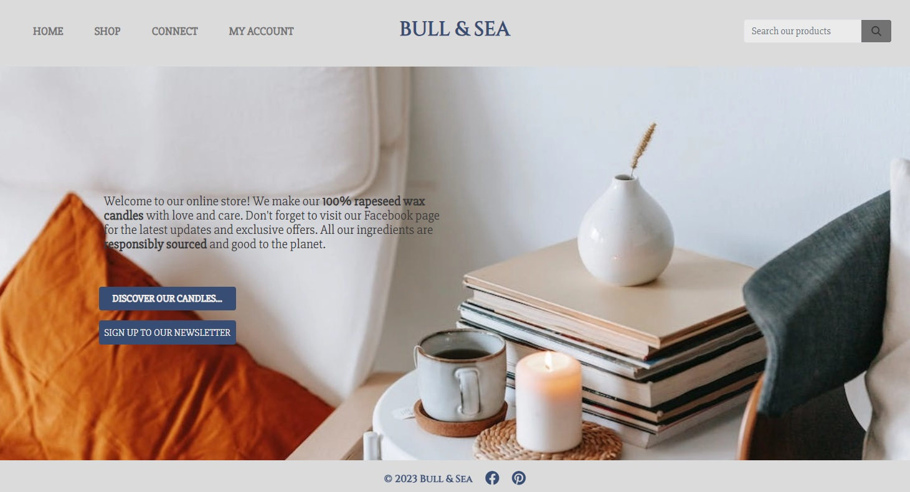
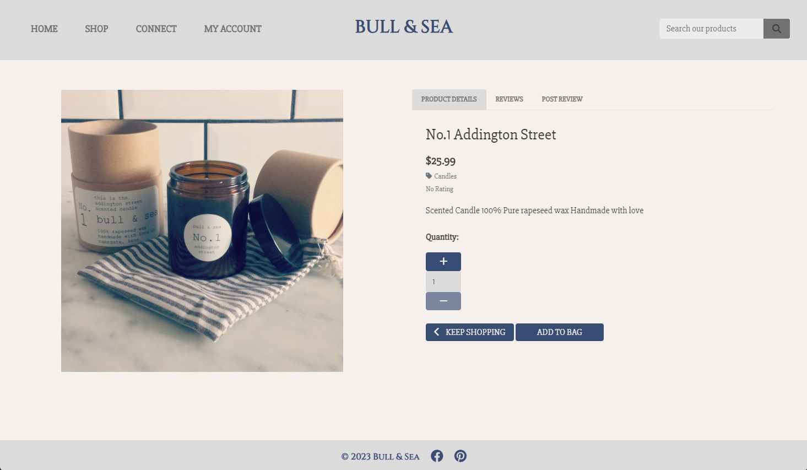

# **BULL & SEA**

Minimal viable product for ecommerce candle and lifestyle product store.

[View live website here](https://p5-bull-and-sea.herokuapp.com/)

<br />


<br />

## [**Table of Contents**](<#table-of-contents>)

<br />

* [**OVERVIEW**](<#overview>)
    * [Site Plan](<#site-plan>)
    * [Business Model](<#business-model>)
    * [Database Schema](<#database-schema>)
    * [User Stories & Agile](<#user-stories-and-agile>)
    * [Wireframes](<#wireframes>)
    * [User Interface](<#user-interface>)
    
<br />

* [**SITE FEATURES**](#site-features)
    * [Inherited Code](#inherited-code)
    * [Depreciated Code](#depreciated-code)
    * [Live Code](#live-code)
    * [Landing Page](#landing-page)
    * [Newsletter Signup](#newsletter-signup)
    * [Products Page](#products-page)
    * [Product Details Page](#product-details-page)
    * [Contact Page](#contact-page)
    * [Contact Messages Page](#contact-messages-page)
    * [Allauth Pages](#allauth-pages)
    * [Manage Products Page](#manage-products-page)
    * [Profile Page](#profile-page)
    * [Bag Page](#bag-page)
    * [Checkout Page](#checkout-page)
    * [Checkout Success Page](#checkout-success-page)
    * [Order History Page](#order-history-view)
    * [Stripe Notes](#stripe-notes)

<br />

* [**ROADMAP**](<#roadmap>)

<br />

* [**TECHNOLOGY USED**](<#technology-used>)
    * [Languages](<#languages>)
    * [Installed Libraries In Requirements](<#installed-libraries-in-requirements>)
    * [Other software & resources](<#other-software-libraries-and-resources>)
    * [Testing resources](<#testing-resources>)

<br />

* [**TESTING**](<#testing>)
    * [Fixed Bugs](<#fixed-bugs>)
    * [Known Issues](<#known-issues>)
    * [Manual Testing](<#manual-testing>)
    * [Validation](<#validation>)
    * [Lessons Learned](<#lessons-learned>)

<br />

* [**SEO**](<#seo>)

<br />

* [**DEPLOYMENT**](<#deployment>)

<br />

* [**CREDITS**](<#credits>)

<br />

* [**ACKNOWLEDGEMENTS**](<#acknowledgements>)

<br />

# **OVERVIEW**

## **Site Plan**

<br>Fully responsive E-commerce website built using Django & Bootstrap to showcase learning outcomes of Porject 5 for my Code Institute course. The website is for a once-real, but now defunct (due to moving countries), actual business that sold artisan candles. This iteration presumes the business is being restarted and now branching into other lifestyle products.

While technically fake, this may serve as a jumping-off point for a new website for this business or, at the very least, a test bed to ideate from, as we plan to restart the business now that we are settled in Ireland.

The design concept is somewhat in keeping with the original site and the existing but dormant Facebook page. It should be an e-commerce site that focuses on a small inventory of items, with high customer engagement and feedback in the form of a review system and wishlist.

The deployed site represents an MVP which would be iterated on going forward.

<br />

## **Business Model**

<br>As detailed above this project is for an artisan candle shop and lifestyle products store. It would operate on a B2C model, focusing on serving individual consumers directly.

The B2C (Business-to-Consumer) model involves businesses selling products or services directly to individual consumers. In relation to this business it would function as follows:

- **Targeting Individual Consumers:** Bull & Sea would focus on catering to the needs and preferences of individual consumers by offering a wide range of products and services. It could also offer B2B services later if the business proved successful.

- **Product Catalog and Display:** Bull & Sea would be an online storefront to showcase their products with detailed descriptions, images, pricing information, and other relevant details.

- **Direct Sales:** Bull & Sea would sell directly to consumers without intermediaries or wholesalers, allowing customers to browse, add items to their carts, and complete purchases through a secure checkout process.

- **Customer Relationship Management:** As a small business Bull & Sea would aim to establish strong relationships with individual customers by providing personalized experiences, exceptional customer service, and post-sales support.

- **Marketing and Promotion:** Bull & Sea would utilise marketing strategies, including digital advertising, social media marketing, and email campaigns, to attract and engage a wide audience. It would put a particularly strong emphasis on Facebook, TikTok and Pinterest.

- **Customer Feedback and Reviews:** Bull & Sea would actively encourage customers to provide feedback, ratings, and reviews to improve the overall customer experience and build trust.

Overall the strategy moving forward to a live version would be to reach out to specific audiences interested in lifestyle and artisan brands to build a name. As this process gathered steam the product inventory could be diversified but not to the point of diluting the brand. It should always remained very focused on it's specific field.

<br />

## **Database Schema**

<br>Here you can see the DB Schema plan visually represented. It inherits the core structure of Product, User and Categories from the walkthrough project.
It adds and changes the following models.

* CHANGED MODELS:
  * PRODUCT: Size removed as this was no longer needed for the products featured. The rating field was also removed and FK relationship to our new Review model was added instead.
  * ORDER LINE ITEM: Size removed, again this was no longer required

* NEW MODELS:
  * REVIEW: A model which tracks and stores all product reviews. It accepts a rating and text based review. The latter is not required to allow user to post ratings without needing to leave a comment (this follows practices seen on sites such as booking.com where users can leave blank reviews) It has a foreign key relationship to Product. This allows multiple reviews of one product. In view for this we add a check to prevent users leaving multiple reviews of the same product (more on this later)
  * NEWSLETTER SIGNUP: A model which simply holds a list of emails which can then be used to send a newsletter to. In a live version this would have to have some form of unsubscribe feature built in but for now this is added as a minimum viable feature to show where this could go. I decided to not relate this to users to allow non registered guests to sign up.
  * CONTACT FORM: A model which allows messages sent by customers to be held in a database. As with the newsletter a decision was made to not attach these messages to users as it would prevent non registered guests using this feature. In a live version this feature could be ideated upon and expanded (see roadmap)

<details>
<summary>Schema</summary>


</details>

<br />

## **User Stories and Agile**

A comprehensive Git project page can be found here with my user stories. Overall, I wanted to focus on getting an MVP working, which could be iterated on later or expanded.

I decided not to use sprints or epics since my timescale here was already quite short. I had to go from no code at all to a working project in 5 weeks, so breaking that into smaller chunks felt unnecessary.

In theory, this would be the first step in a much larger and longer process. This version could see a limited release to a test environment (either for clients or trusted testers), and then use feedback to produce new user stories and move forward.

[Project Board](https://github.com/users/JeffreyBull76/projects/6)


<br />

## **Wireframes**

I used an online wireframe tool to create my basic layout idea. It is by no means exhaustive and was ideated in production to what now exists. It provided a good base to work from.

<details>
<summary>BULL AND SEA WIREFRAME PLAN</summary>


</details>

<br />

### **FINAL SITE STRUCTURE:**
  * The main page structure remains similar to the walkthrough project. It has other templates added where required (such as those for new models)
  * Base page is extended by index which functions as our landing page. In turn the other main template views represented in our navigation are.
      * SHOP - Products > Product Details
      * CONNECT - Contact > Contact Messages (admin feature)
      * MY ACCOUNT - Manage Products (admin feature) > Profile > Allauth account templates
  * I also have a footer (present on all pages) which features the social media linkage.
  * Newsletter signup page - accessed from home page and checkout success page.
  * Bag view page
  * Checkout view page

<br />

<hr>

## **Final Design**

### **Font choices:**
- Cinzel was chosen as a more decorative text for main title. Slabo was chosen as a still decorative, but more readable font, for all other text. Both should elicit a craft / artisan feeling without looking to cold or modern.
    
* Cinzel - for main title font and headings
<br>


<br />

* Slabo - for all other text
<br>


<br />

### **Color palette**
    * The color palette below was chosen to allow the products to take center stage. A distinct vintage blue and muted grey tones where used to evoke an artisan / vintage feeling.
    * Worth noting some slight variations in tone from these were used where appropriate on elements which were small or needed opacity.


* Hopefully the design feeling conveys artisan high quality products. 

<br />

## **User Interface**

The navigation UI is significantly changed mechanically from the walkthrough, and changed in appearance as well. I now have the title central the search bar off to the far right of the screen and all nav buttons on the left. The shopping bag remains hidden until items are added. 

* ETHOS:
  * All pages are fully responsive in line with modern best practices.
  * I left the structure deliberately unclutttered as this is a small scale business.
  * It should be intuitve to find what you need and not require lots of clicking

* CODE:
  * I am using a dropdown navbar element from Bootstrap to build my navigation, the scripting for which sits in a small function in the postload JS block.


* NAVBAR STRUCTURE:
  * The shop button loads a html template (using includes) that iterates through our two product cateogories.
  This allows for new categories to be added dynamically. And a third static element which goes to an all products view.
  * Connect button is populated with two options: 
    * A contact option to allow users to submit forms to the sites admin. 
    * If an admin is logged in this shows the number of messages requiring attention (or displays a message saying no messages)
  * My account is populated with 2 options for non logged users:
    * Register
    * Login
  * My account is populated with 3 options for logged users:
    * Manage products is displayed if user is an admin that navigates to the relevant page.
    * Profile allows updating and reviewing profile and orders.
    * Logout
  * Search Bar: this sits over to the right and allows searching products by keyword in either title or description. It also allows searching multiple terms at once (changed from walkthrough).
  * Shopping cart: this option only appears to users when items are added to current bag session.

<br />

* MOBILE & SMALL SCREEN UI: 

  * The mobile UI changes slightly. There is no home button instead the main site heading functions as a home link. The hamburger menu causes the nav area to slide down and reveals the remaining nav elements which are laid out differently.
    * I may remove the small bag view in the success message on mobile as its fairly intrusive. For now its left but will need user testing in a live environment.
    * The slide in animations for the dropdown menu are removed on small and mobile screens.

<br />

* FOOTER ELEMENT:

  * The site footer is a consistent component that appears on all pages of the website. It features a standard copyright statement and includes two links to the business's social media profiles: Facebook and Pinterest. These links direct visitors to the official Facebook page and Pinterest page of the business. Although the business is currently not active and the pages are not regularly updated, they remain unchanged from the time of the business's initial launch until it was temporarily put on hold due to relocation. In the event of a relaunch, these pages would require updating with new information and products, but for now, they are presented in their original form.

  

<br />

<hr>

### [Contents Menu](<#table-of-contents>)

<hr>

<br />

# **SITE FEATURES**

## **Inherited Code**

The navigation UI in this project has undergone significant changes, both mechanically and visually. The codebase for this project inherits the foundational structure and shared code from the walkthrough blog project on the CI course. The models and basic project structure from the previous project served as a starting pointonly. 

Throughout the development process, the codebase was iterated on and substantially extended. However, it is important to acknowledge the shared lineage and the influence of the initial project.

As this is purely an MVP to showcase learning outcomes, at this time I felt it best to stick to the base structure but later in my roadmap section I will note areas this could change further if it were to become a real project.

STRIPE: A special note on the stripe code and integration used. This is unchanged from the walkthrough project. All webhook handling is tested as working on my live code (see testing later)

<br />

## **Depreciated Code**

The code presented below is my custom code that was once part of the repo but since removed following testing.

<br />

<details><summary>Allowed back buttons to retain search categories / keywords</summary>

```
   <td colspan="5" class="text-right">
   
   <a href="{{ request.META.HTTP_REFERER }}"
       class="rating-button btn rounded-2 text-uppercase">
       <span class="icon-pale pr-2">
           <i class="fas fa-chevron-left"></i>
       </span>
       <span class="text-uppercase">Keep Shopping</span>
   </a>
   
   <a href="" class="rating-button btn rounded-2 text-uppercase">
       <span class="icon-pale pr-2">
           <i class="fas fa-chevron-left"></i>
       </span>
       <span class="text-uppercase">Keep Shopping</span>
   </a>
   
```
<br>

* This code was originally a simple and somewhat clumsy solution to having smart back buttons for the search page. The HTTP_REFERER element allowed it to retain search information. However this created issues with back buttons on pages where the previous page was not a product search. So for example if a user navigated to a product, left a review then used the back button it would just return them to the same page they were on. 

* SOLUTION: For now this functionality was removed and all back buttons return to all products view. See roadmap for future solution ideas to this problem.

</details>

<br />

<details><summary>Old search function</summary>

```
def search_products(request):
    query = request.GET.get('q')

    if query:
        products = Product.objects.filter(Q(name__icontains=query) | Q(description__icontains=query))  # noqa
    else:
        products = Product.objects.none()

    context = {
        'products': products,
        'search_query': query
    }

    return render(request, 'products/products.html', context)
```
<br>

* This code was lacking with the site structure I implemented. Searching is now integrated into the `category_products` view and the `search_products` views which handle the two ways our products are retrieved when rendering the products page (as these two views both filter products in slightly different ways)

</details>

<br />

## **Live Code**
I have added extensive annotation to all my Python files (please review where required) in the live code which details its function and how it was built. This of course could be edited down in a production version but it is included here to show what was learned. The various .py files have this throughout. Some of the code which remains unchanged from the walkthrough does not have any annotation added.

Across all forms and elements validation checks are present where appropriate to prevent invalid entries.

<br />

<hr>

## **Landing Page**

Uses the base template extended by index.html and then further extended by the various templates across the site.

### Features

- **Main page**: Displays splash text introducing the store's main product (rapeseed wax candles) and encourages visitors to explore the candle collection and sign up for the newsletter. The page follows the structure defined in the base.html template (which itself has all our dependencies and meta information).
  * Splash text is concise and descriptive and uses strong styling element to highlight the most relevant keywords for the purposes of web crawlers.

### Notes:
- **Future development**: More detail could be added on the front page, such as scrollable content, pleasant inviting animations and video elements and more prominent links to social media sites.

<br />

<details><summary>LANDING PAGE IMAGE</summary>



</details>

<br />

<hr>

## **Newsletter Signup**

**NEW MODEL**
This page provides a simple and user-friendly interface for collecting user information and subscribing them to periodic email updates.

### Features

- **Signup Form**: The page displays a signup form where users can enter their email address, to subscribe to the newsletter.
- **Terms and Conditions**: A section displaying the terms and conditions of the newsletter subscription. It outlines important information regarding privacy, content usage, age requirements, and more.
- **Unsubscribe Option**: Users are informed that they can unsubscribe from the newsletter at any time. The page provides an email address where users can send their unsubscribe requests.
- **Responsive Design**: The signup page is designed to be responsive, ensuring optimal viewing and interaction across different devices and screen sizes.

### Notes:
- **Future development**: In a live environment an automated backend integration would be required both for the sending of a newsletter and the unsubscribe feature. I did debate adding a delete address feature but it would serve no purpose in a real world project as it would be open to abuse so its left out here. It could eventually be integrated in the expanded admin messaging panel that could allow the composition of newlsetters in the front end and allow updating and targetting signup list addresses though this would require significantly more testing and development than is possible here.
  * For now it exists as is but its current shortcomings are recognised.

<br />

<details><summary>NEWSLETTER SIGNUP IMAGE</summary>


</details>

<br />

<hr>

## **Products Page**

The Product Listing Page renders the product views & provides various features for sorting and presenting products in our database. This page can be accessed from 2 views, either by category or by search term(s). In both cases the sorting works and could be easily extended to provide further functionality.

### Features

- **Product Display**: The page presents a collection of products in a grid layout. Each product is represented as a card with its image, name, price, and category information.
- **Sorting**: Users can sort the products based on price or average rating. The page includes a sorting form with options to select the sorting criteria and direction (ascending or descending). Upon submitting the form, the products are rearranged according to the selected criteria. This sorting works when products 
- **Category Filtering**: If applicable, users can filter the products by a specific category. The page displays a heading indicating the selected category, allowing users to browse products within that category specifically.
- **Search Term Filtering**: If applicable, users can filter the products by a keyword searchs from our nabvar. The page displays a heading indicating the selected search query where applicable.
- **Average Rating**: For products with available reviews, the page calculates and displays the average rating in the form of stars. This allows users to quickly assess the overall quality of each product.
- **Superuser Options**: If the user is a superuser, additional options are provided for editing or deleting products. This functionality enables superusers to manage the product inventory efficiently.
- **Back to Top Button**: A "Back to Top" button is available, allowing users to easily navigate back to the top of the page with a single click.

### Notes:
- **Future development**: In future a way prevent accidental deletion would be required. Either a modal or hidden div could be used which served as a two step deletion process. It is not included here as its relatively simple to add but just adds pointless clicks at a pre-test phase. Following a first deployment to a live testing environment and resultant feedback, a feature such as two step authorization could be added if needed.

<br />

<details><summary>PRODUCTS PAGE IMAGE</summary>


</details>

<br />

<hr>

## **Product Details Page**

**REVIEW TAB IS NEW MODEL**
The Product Detail Page provides detailed information about a specific product. It allows users to view product details, reviews, and make purchases. The page uses Bootstraps built in tabbed content element. It allows us to have 3 distinct sections (see below) for product details, showing current reviews and showing the form to post reviews.

### Features

- **Product Image**: The page displays an image of the product, allowing users to visually assess its appearance.
- **Tabbed Content**: The page organizes information into tabs, providing easy navigation between different sections such as product details, reviews, and post review.
- **Product Details**: The details tab provides comprehensive information about the product, including its name, price, category, average rating, and description. Users can also find a link to the corresponding category page.
  * This tab allows editing and deletion of products in the same way as the products listing page. As there is may require two step authentication in future.
  * Javascript detailed below
- **Reviews**: The reviews tab displays user reviews for the product. Each review includes the username, rating, and comments. Users can also see whether a review is authorized or awaiting authorization. Superusers and staff members have additional options to authorize or delete reviews.
  * Displays users reviews as card elements, the ratings are applied immediately but the review comments are blocked by default until admins authorise them to prevent malicious content being posted.
  * Admins can authorise with one simple button click from here or from admin panel.
  * Once authorised, users can delete their own reviews from here. Admins can delete anyones review.
- **Post Review**: The post review tab allows authenticated users to submit their own reviews for the product. Users can rate the product and provide comments. If the user has already purchased the product, they will see the review form; otherwise, they will be prompted to log in or register.
  * Has various template checks in place. 
  * First checks for authenticated user (registered and logged in)
  * Secondly checks if a review has already been posted by this user for this product.
  * Third it checks if the user has purchased the product (must be in order history)
  * If all three conditions are met it allows the posting of a rating and comment. The comment is not required to allow users to rate products without leaving a text review. 

### Notes:
- **Future development**: Currently it will still display the review card of blank reviews (to allow for deletion and authorisation) but a better solution could be found in future versions if this proved annoying for test users.

<br />

<details><summary>PRODUCT DETAIL IMAGE</summary>



</details>

<details><summary>REVIEWS TAB IMAGE</summary>


</details>

<details><summary>POST REVIEW TAB IMAGE</summary>


</details>

<br />

### **Javascript Used**:

<details><summary>JS Code Block</summary>

```javascript
// Disable +/- buttons outside 1-99 range
function handleEnableDisable(itemId) {
    var currentValue = parseInt($(`#id_qty_${itemId}`).val());
    var minusDisabled = currentValue < 2;
    var plusDisabled = currentValue > 98;
    $(`#decrement-qty_${itemId}`).prop('disabled', minusDisabled);
    $(`#increment-qty_${itemId}`).prop('disabled', plusDisabled);
}

// Ensure proper enabling/disabling of all inputs on page load
var allQtyInputs = $('.qty_input');
for(var i = 0; i < allQtyInputs.length; i++){
    var itemId = $(allQtyInputs[i]).data('item_id');
    handleEnableDisable(itemId);
}

// Check enable/disable every time the input is changed
$('.qty_input').change(function() {
    var itemId = $(this).data('item_id');
    handleEnableDisable(itemId);
});

// Increment quantity
$('.increment-qty').click(function(e) {
   e.preventDefault();
   var closestInput = $(this).closest('.input-group').find('.qty_input')[0];
   var currentValue = parseInt($(closestInput).val());
   $(closestInput).val(currentValue + 1);
   var itemId = $(this).data('item_id');
   handleEnableDisable(itemId);
});

// Decrement quantity
$('.decrement-qty').click(function(e) {
   e.preventDefault();
   var closestInput = $(this).closest('.input-group').find('.qty_input')[0];
   var currentValue = parseInt($(closestInput).val());
   $(closestInput).val(currentValue - 1);
   var itemId = $(this).data('item_id');
   handleEnableDisable(itemId);
});
```

- The `products/templates/products/includes/quantity_input_script.html` javascript handles the quantity inputs(see above):
1. The `handleEnableDisable` function disables the "+" button if the current quantity is 1 or less, and disables the "-" button if the current quantity is 98 or more.
2. On page load, the code ensures that the proper buttons are enabled or disabled for all quantity inputs.
3. Every time a quantity input is changed, the code checks and adjusts the enable/disable state of the buttons accordingly.
4. The code increments the quantity by 1 when the "+" button is clicked, updates the input value, and adjusts the enable/disable state.
5. The code decrements the quantity by 1 when the "-" button is clicked, updates the input value, and adjusts the enable/disable state.

</details>

<br />

<hr>

## **Contact Page**

**NEW MODEL**
The Contact Page allows users to get in touch with the website administrators / owners. It provides a convenient and user-friendly interface for users to send inquiries, feedback, or any other messages. All contact form enquiries are saved to the database to prevent loss of data and allow for future functionality and cross app features.

### Features

- **Contact Form**: The page includes a contact form where users can enter their information, such as name, email, phone number, and message. 
- **User-Friendly Interface**: The contact form is designed to be intuitive and easy to use, ensuring a smooth experience for users when submitting their inquiries.
- **Validation and Error Handling**: The form includes validation checks to ensure that required fields are filled out correctly. If there are any errors or missing information, appropriate error messages are displayed to guide users in correcting their input.
- **Responsive Design**: A decision was taken to not link contact form entries to a specific user or user profile, as this would prevent non registered users from accessing this.

### Notes:
- **Future development**: In future more checks could be added so it still allowed non registered access, but also tracked contact forms sent by registered users and linked them to their profile.

<br />

<details><summary>CONTACT PAGE IMAGE</summary>


</details>

<br />

<hr>

## **Contact Messages Page**

The Contact Messages Page displays messages submitted through the contact form. It serves as a front end page for managing customer and business-to-business inquiries that require attention. The page provides an organized view of the contact messages, allowing administrators to review and take necessary actions.

### Features

- **Message Overview**: The page provides an overview of contact messages, including the first name, last name, email, phone number, comment, and creation timestamp for each message.
- **Attention Indicator**: Administrators can quickly identify new messages that require attention through an attention indicator. The page displays the count of new messages that need to be reviewed.
- **Delete Functionality**: Superusers have the option to delete messages directly from the page. A delete button is provided for each message, enabling efficient management of messages.

### Notes:
- **Future development**: This page is mostly included as a first proof of concept for a larger in app messaging / contact system. It would require 1 or more of the following going forward.
  * Track new and old messages: This could be done relatively simply if this feature proved useful. It would mean admins could flag messages as 'read' without deleting them meaning they would no longer show as new messages but would still remain in the database. They could then be rendered on a separate page (archived messages) so data was retained but they didn't clog up the page.
  * Allow front end form creation for admins to answer messages from this page. A message could be selected which navigated to a reply form. If hooked up to the backend correctly could send an email directly from the this page without requiring separate emails to be sent.
  * If users and user profiles were hooked up to this feature it would allow querying of orders and other such functionality.

<br />

<details><summary>CONTACT MESSAGES PAGE IMAGE</summary>


</details>

<br />

<hr>

## **Allauth Pages**

The Base Allauth template is used as a foundation for other urls within the website. It provides a consistent structure and layout for the pages while allowing customization of specific content sections.

### Features

- **User Menu**: The menu section provides options for user authentication. If the user is authenticated, they can access actions like changing their email or signing out. If the user is not authenticated, options for signing in or signing up are available.
  * Users can login, logout, register and so on from here, it uses Allauths templates but customised to suit the project

<br />

<details><summary>ALLAUTH PAGE IMAGE</summary>


</details>

<br />

<hr>

## **Manage Products Page**

### Add Product Page

The Add Product Page allows admins to add new products to the website's product inventory. It provides a user-friendly interface for entering product details and uploading an associated image. The page is designed to streamline the product addition process and ensure accurate information for each new product.

### Features

- **Product Form**: The Add Product Page includes a form where users can enter the details of the new product. The form includes fields for various attributes, such as product name, price, description, and category. The form is designed using the Django Crispy Forms library, which enhances form rendering and validation.
- **Image Upload**: Users can select an image file to associate with the new product. The page includes an image upload field that allows users to choose an image file from their local device. The selected image file name is displayed dynamically to provide visual feedback.
  * The widget used here is the same as the walkthrough project.
- **Form Submission**: Upon completing the product details and uploading the image, users can submit the form. The form data is sent via a POST request to the server, where it is processed and saved to the database. Successful submission redirects the user to the products page, allowing them to view the newly added product in the inventory.

### Edit products page

Is broadly similar but simply allows editing of existing products rather than adding new ones.

### Notes:
- **Future development**: Integrate a way to autoupload images to AWS on form submission (currently manually uploading the image is required)

<br />

<details><summary>MANAGE PRODUCTS IMAGE</summary>


</details>

<br />

<hr>

## **Profile Page**

The Profile Page provides users with access to their account information and order history. It allows users to view and update their default delivery information and review their past orders. The page is designed to be user-friendly and responsive.

### Features

- **Default Delivery Information**: Users can view their default delivery information, such as name, address, and contact details, conveniently displayed on the page.
- **Update Information**: A form is provided for users to update their default delivery information. The form is pre-populated with the existing data and includes fields for users to make changes. Upon submitting the form, the updated information is saved to the database (form validation is present)
- **Order History**: Users can access a table displaying their order history. Each order entry includes the order number, date, items purchased, and the total order amount.
- **Order Details**: By clicking on the order number, users can navigate to a detailed view of a specific order. This view provides additional information about the order, including individual products purchased and their quantities.
- **Post-load JavaScript**: Additional JavaScript functionality is included at the end of the page for handling country fields. The JavaScript file "countryfield.js" is loaded for this purpose.

### Notes:
- **Future development**: In future as mentioned earlier, greater integration with the messaging system could be put in place. Allowing users to perform some tasks from within their profile, such as messaging site admins, unsubscribing to the newsletter etc.

<br />

<details><summary>PROFILE PAGE IMAGE</summary>


</details>

<br />

<hr>

## **Bag Page**

The Shopping Bag page allows users to view the items they have added to their bag while shopping on the website. It provides an overview of the items, their prices, quantities, and subtotal amounts. Users can adjust the quantities of items, remove items from the bag, and proceed to secure checkout. 

### Features

- **Table Overview**: The page displays a table with a detailed overview of the items in the shopping bag. Each row represents an individual item and includes the item's image, name, price, quantity, and subtotal amount.
- **Update Quantity**: Users can update the quantity of each item by adjusting the corresponding input field. The quantity update is performed using an increment and decrement functionality.
- **Remove Item**: Users can remove an item from the shopping bag by clicking the "Remove" link next to the item. The page automatically updates to reflect the changes.
- **Bag Total**: The page displays the total price of the items in the bag, including the subtotal and delivery charges (if applicable). The grand total, which includes the bag total and delivery charges, is also shown.
- **Navigation Buttons**: Users can navigate back to the product listing page to continue shopping or proceed to the secure checkout page using the provided navigation buttons.

### Javascript used

- This JavaScript code loaded from `quantity_input_script.html`used earlier in the product details page.
- This code handles the functionality of updating the quantity of an item and removing an item from the shopping bag in this template.

<details><summary>JS Code Block</summary>

```// Update quantity on click
    $('.update-link').click(function(e) {
        var form = $(this).prev('.update-form');
        form.submit();
    });

    // Remove item and reload on click
    $('.remove-item').click(function(e) {
        var csrfToken = "{{ csrf_token }}";
        var itemId = $(this).attr('id').split('remove_')[1];
        var url = `/bag/remove/${itemId}/`;
        var data = {'csrfmiddlewaretoken': csrfToken};

        $.post(url, data)
         .done(function() {
             location.reload();
         });
    });
  ```

1. The `$('.update-link').click(...)` function is triggered when the "Update" link is clicked. It selects the corresponding form element and submits it, triggering the form submission action.
2. The `$('.remove-item').click(...)` function is triggered when the "Remove" link is clicked. It retrieves the necessary information such as the CSRF token and the item ID from the HTML attributes. Then, it sends a POST request to the specified URL with the data. If the request is successful, it reloads the page.

</details>

<br />

<details><summary>BAG PAGE IMAGE</summary>


</details>

<br />

<hr>

## **Checkout Page**

The Checkout Page where users can complete their orders by providing necessary details and making payments.

### Features

- **Order Summary**: The Checkout Page displays a summary of the user's order, including the number of items in the order and the total order amount. Each item in the order is listed, showing the item's name, size (if applicable), quantity, and subtotal.
- **Form for Order Completion**: Users are presented with a form to fill out their details for order completion. The form includes fields for the user's full name, email, phone number, delivery address (street address, town/city, county, and postcode), and country.
- **Saving Delivery Information**: If the user is authenticated, they have the option to save their delivery information to their profile by checking the "Save this delivery information to my profile" checkbox.
- **Payment**: The Checkout Page includes a payment section where users can enter their payment information. It utilizes Stripe as the payment gateway, providing a secure and seamless payment experience.
- **Navigation**: Users have the ability to adjust their bag and return to the previous page by clicking the "Adjust Bag" button. They can also complete their order by clicking the "Complete Order" button.

### JavaScript Functionality

- **Stripe Elements**: The page includes the necessary JavaScript code to integrate Stripe Elements for handling the payment section. It sets up the Stripe card element and displays any form errors or validation messages to the user.
- **Loading Overlay**: A loading overlay is displayed while the page is processing information or waiting for a response. It provides visual feedback to the user, indicating that the page is working on their request.

### Notes:
- **Future development**: Full site would require setup so actual order fulfilment, stock tracking and payments were processed (beyond scope of this project)

<br />

<details><summary>CHECKOUT PAGE IMAGE</summary>


</details>

<br />

<hr>

## **Checkout Success Page**

The checkout success page is displayed to users after they have successfully placed an order. This Markdown readme description provides an overview of the Order Confirmation Page and its features.

### Features

- **Order Information**: The page displays the order details, including the order number, order date, and order items. Each item in the order is listed, showing the product name, quantity, and individual price.
- **Delivery Information**: The page also presents the delivery information provided by the user during the checkout process. This includes the user's full name, address details (street address, city/town, county, postal code), country, and phone number.
- **Billing Information**: The order's billing information is displayed, including the order total, delivery cost, and grand total.
- **Navigation**: Users can navigate back to their profile page or the home page, depending on their context. The appropriate navigation link is displayed based on whether the user accessed the page from their profile or directly from the checkout process.
- **Newsletter Subscription**: Users are provided with an option to sign up for the newsletter by clicking the "Sign up to our newsletter" button. This integration allows users to stay updated with the latest offers and promotions.

### Notes:
- **Future development**: This could in theory be integrated into the proposed internal messaging system so users could attach notes to their deliveries. So for example if they wanted special delivery notes added or wrapped as a gift for somebody (etc)

<br />

<details><summary>CHECKOUT SUCCESS PAGE IMAGE</summary>


</details>

<br />

<hr>

## **Order History View**

The same as the previous checkout success page, but called by clicking on order number within a users profile (see image below)

### Notes:
- **Future development**: This could in theory be integrated into the proposed internal messaging system so users could receive updates on their order, raise queries or complaints directly from within the app.
  * Could also have repeat order functionality added to allow easily repeating an order.

<br />

<details><summary>ORDER HISORY VIEW IMAGE</summary>


</details>

<br />

<hr>

## **STRIPE NOTES**

The Stripe payment system has been integrated into the site to provide a secure payment processing solution. It's integration follows the walkthrough project exactly.

### MVP Implementation and Webhooks

It's important to emphasize that the current implementation of Stripe's payment system in this project is focused on MVP functionality and does not include full payment processing capabilities. The primary purpose is to enable user testing and evaluate the integration of webhooks.

Webhooks play a crucial role in this MVP implementation. They are endpoints that allow Stripe to send real-time notifications to your application regarding specific payment events. With webhooks we can track and respond to events such as successful payments, failed charges, and subscription updates, it also prevents user errors like double inputs of orders, loss of data if navigating away during form submission... and so on.

Please keep in mind that while the current implementation may not process actual payments, it serves as a foundation for future enhancements. In future development full integration with the API could be coded to allow actual payments to be made.

<br />

<hr>

### [Contents Menu](<#table-of-contents>)

<hr>

# **ROADMAP**

- **MORE IMAGES ON PRODUCTS**: Currently only one image exists, this could be changed so each product in the product detail view had a carousel of multiple images. This would likely be added in next development cycle.

- **CONTACT FORM EXPANSION / INTERNAL MESSAGING SYSTEM**: For now, this remains a proof of concept for what could become an internal messaging system for admins to answer customer inquiries. In theory, it could be expanded to allow the adding of different types of contact (such as business-to-business, complaints, etc.). Whether this proves a worthwhile use of development time would need to be judged after a test deploy and extensive user feedback. As detailed in various sections above, this could be integrated across many different features to allow users and admins to communicate more easily within the app.

- **DYNAMIC BACK BUTTONS**: In testing I did have a version (see depreciated code) of dynamic back buttons implemented. As discussed above that was sub optimal and removed for the MVP. Using either a stored session variable or use of template logic similar to how the checkout bag quick view recognises the page you are on, back buttons which direct to different pages based on where you had come from could be implemented. 
  * The former would be preferable but would require cookies and other solutions beyond the scope of this MVP

- **WISHLIST SYSTEM**: The wishlist system would enable users to save their favorite products for future reference or potential purchase. Users will be able to add items to their wishlist, view and manage the wishlist, and receive notifications for changes in availability or discounts on wishlisted items.

- **SALE / OFFERS SYSTEM**: This feature aims to implement a sale/offers system to provide special discounts and promotions to users. It will enable the display of discounted prices, limited-time offers, promotional codes, or bundle deals, enhancing the user's shopping experience and encouraging increased sales. In pracice admins could set a special offer template and then apply its logic to products dynamically. I feel this would be desirable but also beyond the scope of this project currently.
  * Users are not required to sign up but in a live version incentives such as this discount system could be offered to encourage sign ups. 

- **DELETE CONFIRMATION SYSTEM**: Working from feedback from the current MVP, a delete confirmation pop-up may be added to enhance user experience and prevent accidental deletion of important data. This system will prompt users to confirm their action before permanently deleting any content. I left this out for now as I felt implementing then removing it, represented bad coding practice. Rather it was better to ommit now and add later if required in a live version.

- **EXPANDED TAG LIST AND INTEGRATION**: This feature involves expanding the existing tag list and integrating it more comprehensively throughout the application. It will enhance product categorization, filtering, and search functionality, making it easier for users to find specific products based on their interests or preferences. This feels unwarranted for this particular site, as the product list would never be overly long. But it could be implemented further down the line.

- **FLAG ITEMS THAT ARE NO LONGER AVAILABLE**: Currently if an admin deletes an item it does not cascade and delete orders associated with that product. This is desirable as to not invalidate past orders, however a way of noting this to Admins that orders contain no longer available prducts would be desirable, this could be part of a larger admin panel (see message system above)

<br />

<hr>

### [Contents Menu](<#table-of-contents>)

<hr>

# **TECHNOLOGY USED**

## **Languages**
  * [HTML](https://www.w3.org/standards/webdesign/htmlcss) - Base structure
  * [CSS](https://www.w3.org/standards/webdesign/htmlcss) - Style elements
  * [Javascript](https://developer.mozilla.org/en-US/docs/Web/javascript) - Some interactive elements
  * [Python](https://www.python.org/) - Backend functionality

<br />

## **Installed libraries in Requirements**
  * [asgiref](https://pypi.org/project/asgiref/)
  * [Boto3](https://pypi.org/project/boto3/)
  * [dj-database-url](https://pypi.org/project/dj-database-url/0.5.0/)
  * [Django](https://pypi.org/project/Django/)
  * [django-allauth](https://pypi.org/project/django-allauth/)
  * [django-countries](https://pypi.org/project/django-countries/7.2.1/)
  * [django-crispy-forms](https://pypi.org/project/django-crispy-forms/)
  * [django-storage](https://pypi.org/project/django-storages/1.13.2/)
  * [gunicorn](https://pypi.org/project/gunicorn/)
  * [oauthlib](https://pypi.org/project/oauthlib/)
  * [jmespath](https://pypi.org/project/jmespath/1.0.1/)
  * [Pillow](https://pypi.org/project/Pillow/)
  * [psycopg2](https://pypi.org/project/psycopg2/)
  * [python3-openid](https://pypi.org/project/python3-openid/3.2.0/)
  * [pytz](https://pypi.org/project/pytz/)
  * [requests-oauhlib](https://pypi.org/project/requests-oauthlib/)
  * [sqlparse](https://pypi.org/project/sqlparse/)
  * [s3transfer](https://pypi.org/project/s3transfer/)
  * [stripe](https://pypi.org/project/stripe/)

<br />

## **Other software, libraries and resources**
  * [Bootstrap](https://getbootstrap.com/) - used for base style elements and layout
  * [Font Awesome](https://fontawesome.com/) - used for landing page icons
  * [Jquery](https://cdnjs.com/libraries/jquery) - used throughout the site
  * [Popper JS](https://cdnjs.com/libraries/popper.js) - Library used in forms.py
  * [Django](https://www.djangoproject.com/) - A model-view-template framework used to create the Review | Alliance site
  * [Github](https://github.com/) - Used to host this repository
  * [Gitpod](https://www.gitpod.io) - Used to edit and push to the repo, the native validator was used to validate all Python code.
  * [Heroku](https://id.heroku.com/login) - Cloud platform the live site is deployed to
  * [AWS](https://aws.amazon.com/) - Used to host images 
  * [Fluid UI](https://www.fluidui.com/) - Used to create wireframe
  * [Favicon](https://favicon.io/) - Used to create favicon
  * [Coolors](https://coolors.co/) - Used to create color palette
  * [DRAW Sql](https://drawsql.app/) - Used to create visual DB schema
  * [CSS Tricks](https://css-tricks.com/css-link-hover-effects/) - Arrow effect for messages
  * [Placeholder Images](https://placehold.co/) - Use to generate placeholder images fully configurable.
  
<br />

## **Testing resources**
  * [HTML Validation](https://validator.w3.org/) - Used to validate HTML code
  * [CSS Validation](https://jigsaw.w3.org/css-validator/) - Used to validate CSS code
  * [JSHint Validation](https://jshint.com/) - Used to validate JavaScript code
  * [PyCodeStyle](https://pypi.org/project/pycodestyle/) - Used to validate all python code
  * [Lighthouse](https://developer.chrome.com/docs/lighthouse/overview/) - Performance testing resource
  * [Responsive Design Checker](https://www.responsivedesignchecker.com/) - Used for responsiveness check
  * [Google Chrome DevTools](https://developer.chrome.com/docs/devtools/) - Used throughout the project to debug and test
  * [Wave Web Accessibility Evaluation Tool](https://wave.webaim.org/) - Used to validate the site's accessibility

<br />

<hr>

### [Contents Menu](<#table-of-contents>)

<hr>

# **TESTING**

## **Fixed Bugs**
* No major bugs existed worthy of note except the one piece of unwanted function introduced by trying to provide dynamic back buttons (see depreciated code entry on this).

<br />

## **Known Issues**
* Currently users have no way of actually unsubscribing from the newsletter (addressed above)
* Loading times for the application are slower than I would like due to heavy use of scripting and no ability to set or change cache policy. It also attempts to preload all data due to page structure and templates. In a real launch this would need to be addressed with host.
* Some accessability issues around contrast are noted but I have chosen to accept them currently, I would need this to be tested by visually imparied users to see if it needed changing.

<br />

## **Manual Testing**
All user stories marked as 'done' on our project board [HERE](https://github.com/users/JeffreyBull76/projects/6) were tested and signed off.

  * Below you can see the manual testing that was performed on each page of the site.

<br />

| Status | **Landing Page** |
|:-------:|:--------|
| &check; | Custom 404 page exists and shows when the user manually enters an incorrect address extension |
| &check; | The page extends the `base.html` template correctly. It inherits the common layout and styling from the base template. |
| &check; | The necessary static files are loaded. |
| &check; | The page has a proper header container. The header container is present and styled within the `container` class. |
| &check; | All landing page links navigate to the correct pages |
| &check; | The landing page responds to different screen sizes correctly |
| &check; | Using the navigation works correctly |
| &check; | All scripts and resources load correctly |
| &check; | The footer at the bottom shows correctly and the links work |
| &check; | The navbar displays correctly and all links work |
| &check; | Messaging system present on main page and throughout site |

<br />

| Status | **Navigation Bar** |
|:-------:|:--------|
| &check; | The "Home" link is active |
| &check; | The "Shop" dropdown menu is displayed |
| &check; | The "Connect" dropdown menu is displayed |
| &check; | The "My Account" dropdown menu is displayed |
| &check; | The shopping bag link is displayed when bag items are present |
| &check; | The search form is present and functional |
| &check; | The search box displays an error message when submitting without a query |

<br />

| Status | **Newsletter Signup Page**
|:-------:|:--------|
| &check; | Custom 404 page exists and shows when the user manually enters an incorrect address extension |
| &check; | The page extends the `base.html` template correctly. It inherits the common layout and styling from the base template. |
| &check; | The necessary static files are loaded. |
| &check; | Clicking the title reloads to index.html landing page |
| &check; | The page has a proper header container. The header container is present and styled within the `container` class. |
| ~~x~~ | Users can Unsubscribe from the newsletter (see known issues) |
| &check; | The necessary static files are loaded |
| &check; | The page header container is displayed |
| &check; | Entering incorrect data prevents form submission and generates an error message |
| &check; | The signup form card is present and styled correctly |
| &check; | The signup form is rendered within the card |
| &check; | The form includes a CSRF token |
| &check; | The form elements are displayed correctly |
| &check; | The submit button submits the form correctly |
| &check; | The terms and conditions card is present and styled correctly |
| &check; | The terms and conditions content is displayed correctly |
| &check; | The email address for unsubscribing is properly formatted and linked |
| &check; | The privacy policy and disclaimer statements are displayed correctly |
| &check; | The terms and conditions notice is displayed correctly |

<br />

| Status | **Products Listing Page** |
|:-------:|:--------|
| &check; | Custom 404 page exists and shows when the user manually enters an incorrect address extension |
| &check; | The page extends the `base.html` template correctly. It inherits the common layout and styling from the base template. |
| &check; | The necessary static files are loaded. |
| &check; | Clicking the title reloads to index.html landing page |
| &check; | The page has a proper header container. The header container is present and styled within the `container` class. |
| &check; | The sub-heading is displayed correctly based on the category or search query |
| &check; | The sorting form is displayed correctly |
| &check; | The sorting options are rendered properly |
| &check; | The current sorting option is selected correctly |
| &check; | The product cards are displayed in a grid layout |
| &check; | Each product card includes an image |
| &check; | The product name is displayed correctly |
| &check; | The product price is displayed correctly |
| &check; | The product category is displayed correctly if available |
| &check; | The average rating is displayed correctly if available |
| &check; | The edit and delete links are displayed for superusers |
| &check; | The "Back to Top" button is displayed |
| &check; | The "Back to Top" button scrolls to the top of the page when clicked |
| &check; | If no products match the search, a proper message is displayed |

<br />

| Status | **Product Details Page** |
|:-------:|:--------------|
| &check; | Custom 404 page exists and shows when the user manually enters an incorrect address extension |
| &check; | The page extends the `base.html` template correctly. It inherits the common layout and styling from the base template. |
| &check; | The necessary static files are loaded. |
| &check; | Clicking the title reloads to index.html landing page |
| &check; | The page has a proper header container. The header container is present and styled within the `container` class. |
| &check; | The content block is defined and filled with content |
| &check; | The image element displays correctly with a fallback for missing images |
| &check; | The tabbed content section is displayed correctly |
| &check; | The tab headers are rendered properly |
| &check; | The tab content is displayed and functional |
| &check; | The details tab shows the product details accurately |
| &check; | The reviews tab shows reviews and handles authorization correctly |
| &check; | The post review tab is displayed based on user authentication |
| &check; | The add review form is displayed for users who have purchased the product |
| &check; | The script for quantity input is included and functions correctly |
| &check; | The script for handling tabbed content is included and works as expected |

<br />

| Status | **Contact Form Page**  |
|:-------:|:----------|
| &check; | Custom 404 page exists and shows when the user manually enters an incorrect address extension |
| &check; | The page extends the `base.html` template correctly. It inherits the common layout and styling from the base template. |
| &check; | The necessary static files are loaded. |
| &check; | Clicking the title reloads to index.html landing page |
| &check; | The page has a proper header container. The header container is present and styled within the `container` class. |
| &check; | The content block is defined and filled with content |
| &check; | The form elements are displayed correctly |
| &check; | Error messages are displayed for invalid form inputs |
| &check; | The form submission is handled properly |
| &check; | Cancel button redirects to the products page |
| &check; | Submit button submits the form |

<br />

| Status | **Contact Form Management Page** |
|:-------:|:----------|
| &check; | Custom 404 page exists and shows when the user manually enters an incorrect address extension |
| &check; | The page extends the `base.html` template correctly. It inherits the common layout and styling from the base template. |
| &check; | The necessary static files are loaded. |
| &check; | Clicking the title reloads to index.html landing page |
| &check; | The page has a proper header container. The header container is present and styled within the `container` class. |
| &check; | Page is restricted for superusers only |
| &check; | The message cards are displayed correctly with the appropriate styling. |
| &check; | The message details are shown in each card. The card displays the details of each contact message, such as the first name, last name, email, phone number, comment, and created date. |
| &check; | The number of new messages is displayed correctly. The appropriate message is displayed indicating the count of new messages. If there are no new messages, a message indicating so is displayed. |
| &check; | Delete button is displayed for each message card. |
| &check; | Delete button performs the delete action and removes the associated DB item. |

<br />

| Status | **Add Products Page** |
|:-------:|:----------|
| &check; | Custom 404 page exists and shows when the user manually enters an incorrect address extension |
| &check; | The page extends the `base.html` template correctly. It inherits the common layout and styling from the base template. |
| &check; | The necessary static files are loaded. |
| &check; | Clicking the title reloads to index.html landing page |
| &check; | The page has a proper header container. The header container is present and styled within the `container` class. |
| &check; | The form to add a new product is rendered correctly. The form fields are displayed properly with appropriate styling. |
| &check; | The form includes a file upload field. The form contains an input field for uploading an image file. |
| &check; | The form submission is handled properly. When the form is submitted, it triggers the appropriate action URL and includes the necessary CSRF token. |
| &check; | Entering incorrect data prevents form submission and generates an error message |
| &check; | The cancel button redirects to the products page. Clicking the cancel button redirects the user to the products page. |
| &check; | The add product button submits the form. Clicking the add product button successfully submits the form and adds the product. |
| &check; | The image filename is displayed dynamically. When a file is selected for upload, the filename is displayed dynamically on the page. |
| &check; | The JavaScript code executes correctly. |

<br />

| Status | **Edit Products Page** |
|:-------:|:----------|
| &check; | Custom 404 page exists and shows when the user manually enters an incorrect address extension |
| &check; | The page extends the `base.html` template correctly. It inherits the common layout and styling from the base template. |
| &check; | The necessary static files are loaded. |
| &check; | Clicking the title reloads to index.html landing page |
| &check; | The page has a proper header container. The header container is present and styled within the `container` class. |
| &check; | Entering incorrect data prevents form submission and generates an error message |
| &check; | The form to edit a product is rendered correctly |
| &check; | The form fields are displayed appropriately |
| &check; | The form handles the submission properly |
| &check; | The cancel button redirects to the products page |
| &check; | The edit product button performs the edit action |
| &check; | The script for handling the image selection is included and functions correctly |

<br />

| Status | **Profile Page** |
|:-------:|:----------|
| &check; | Custom 404 page exists and shows when the user manually enters an incorrect address extension |
| &check; | The page extends the `base.html` template correctly. It inherits the common layout and styling from the base template. |
| &check; | The necessary static files are loaded. |
| &check; | Clicking the title reloads to index.html landing page |
| &check; | The page has a proper header container. The header container is present and styled within the `container` class. |
| &check; | The CSS file for the profile page is included |
| &check; | Entering incorrect data prevents form submission and generates an error message |
| &check; | The form to update the default delivery information is rendered correctly |
| &check; | The form fields are displayed appropriately |
| &check; | The form handles the submission properly |
| &check; | The order history table is displayed |
| &check; | The order history table shows the order details correctly |
| &check; | The order numbers link to their respective order history page |
| &check; | The country field JavaScript file is included and works correctly |

<br />

| Status | **Allauth Pages** |
|:-------:|:----------|
| &check; | Custom 404 page exists and shows when the user manually enters an incorrect address extension |
| &check; | Clicking the title reloads to index.html landing page |
| &check; | The DOCTYPE declaration is present and correct |
| &check; | The HTML structure is valid |
| &check; | The page title is set dynamically using a block |
| &check; | The extra_head block is present and empty |
| &check; | The body block is defined and filled with content |
| &check; | Messages are displayed if present |
| &check; | The menu section is displayed |
| &check; | The menu items are rendered based on user authentication |
| &check; | The menu links are correctly configured |
| &check; | The content block is defined and empty |
| &check; | The extra_body block is present and empty |
| &check; | The page is correctly extended by the various Allauth templates related to logging in and signing up |

<br />

| Status | **Checkout Page** |
|:-------:|:-----------------|
| &check; | Custom 404 page exists and shows when the user manually enters an incorrect address extension |
| &check; | The page extends the `base.html` template correctly. It inherits the common layout and styling from the base template. |
| &check; | The necessary static files are loaded. |
| &check; | Clicking the title reloads to index.html landing page |
| &check; | The page has a proper header container. The header container is present and styled within the `container` class. |
| &check; | The CSS file for the checkout page is included |
| &check; | The order summary section is displayed, showing the items in the bag, their details, and subtotals |
| &check; | The order summary section displays the correct total, delivery cost, and grand total |
| &check; | Entering incorrect data prevents form submission and generates an error message |
| &check; | The form for order details is rendered correctly |
| &check; | The form fields for order details are displayed appropriately |
| &check; | The form handles the submission properly |
| &check; | The delivery details section is displayed, showing the fields for name, email, phone number, address, and country |
| &check; | The "Save this delivery information to my profile" checkbox is displayed correctly and works |
| &check; | The payment section is displayed, showing the Stripe card element |
| &check; | The "Adjust Bag" button redirects to the bag view |
| &check; | The "Complete Order" button submits the form and initiates the payment process |
| &check; | The loading overlay is displayed during the payment processing |
| &check; | The Stripe public key and client secret are included as JSON scripts |
| &check; | The Stripe Elements JavaScript file is included |

<br />

| Status | **Checkout Success Page** |
|:-------:|:----------|
| &check; | Custom 404 page exists and shows when the user manually enters an incorrect address extension |
| &check; | The page extends the `base.html` template correctly. It inherits the common layout and styling from the base template. |
| &check; | The necessary static files are loaded. |
| &check; | Clicking the title reloads to index.html landing page |
| &check; | The page has a proper header container. The header container is present and styled within the `container` class. |
| &check; | The order information is displayed correctly. The order number, order date, and confirmation message are shown. |
| &check; | The order details table is displayed. It includes the product name, quantity, and price for each item in the order. |
| &check; | The delivering information is displayed. The full name, address, town/city, country, and phone number are shown. |
| &check; | If available, the address line 2, county, and postal code are displayed correctly. |
| &check; | The billing information is displayed. The order total, delivery cost, and grand total are shown. |
| &check; | The back button correctly navigates to the previous page (profile or home). |
| &check; | The "Sign up to our newsletter" button redirects to the sign-up page. |

<br />

| Status | **Admin Page**
|:-------:|:--------|
| &check; | Custom 404 page exists and shows when the user manually enters an incorrect address extension |
| &check; | All standard admin functionality is available |
| &check; | All data is admissable from the Admin panel in line with the models |
| &check; | Users are able to navigate back to the site easily |

<br />

| Status | **Mobile / Small Screen View** |
|:-------:|:--------|
| &check; | All above functionality also works on mobile and small screens |

<br />

## **Validation**

### **HTML validation:**
 All HtML was vaidated and returned no errors. See below for warnings:

- **All script tags return the following warning:**
- Warning: The type attribute is unnecessary for JavaScript resources.

I tried removing these but it stopped some of the scripts working, as its only a warning it is left in but noted.

<details><summary>HTML Validation</summary>

[Landing page validation](https://validator.w3.org/nu/?doc=https%3A%2F%2Fp5-bull-and-sea.herokuapp.com%2F)

[Products page validation](https://validator.w3.org/nu/?doc=https%3A%2F%2Fp5-bull-and-sea.herokuapp.com%2Fproducts%2F)

[Contact page validation](https://validator.w3.org/nu/?doc=https%3A%2F%2Fp5-bull-and-sea.herokuapp.com%2Fcontact%2F)

[Contact form management validation](https://validator.w3.org/nu/?doc=https%3A%2F%2Fp5-bull-and-sea.herokuapp.com%2Fcontact-management%2F)

[Bag Page validation](https://validator.w3.org/nu/?doc=https%3A%2F%2Fp5-bull-and-sea.herokuapp.com%2Fbag%2F)

[Checkout page validation](https://validator.w3.org/nu/?doc=https%3A%2F%2Fp5-bull-and-sea.herokuapp.com%2Fcheckout%2F)

[Add products page validation](https://validator.w3.org/nu/?doc=https%3A%2F%2Fp5-bull-and-sea.herokuapp.com%2Fproducts%2Fadd%2F)

[Profile page validation](https://validator.w3.org/nu/?doc=https%3A%2F%2Fp5-bull-and-sea.herokuapp.com%2Fprofile%2F)

[Signup page validation](https://validator.w3.org/nu/?doc=https%3A%2F%2Fp5-bull-and-sea.herokuapp.com%2Fsignup%2F)

[Product details page validation](https://validator.w3.org/nu/?doc=https%3A%2F%2Fp5-bull-and-sea.herokuapp.com%2Fproducts%2F3%2F)

Checkout success page excluded from pre-built list due to requiring specific order item to search. This has been tested and returned no errors.

<br />

</details>

<hr>

<br />

### **CSS validation:**
All code was checked and returns no errors.

<details><summary>CSS Validation</summary>

[CSS validation](https://jigsaw.w3.org/css-validator/validator?uri=https%3A%2F%2Fp5-bull-and-sea.herokuapp.com%2F&profile=css3svg&usermedium=all&warning=1&vextwarning=&lang=en)

<br />

</details>

<hr>
  
<br />

### **Javascript validation:**

All JS tested and passed, warnings are non critical and ignored (beyond scope of project)

<details><summary>JS Validation Images</summary>


Other JS was not tested as it consists of bootstrap elements to control dropdowns and similar functionality.

</details>

<hr>
  
<br />

### **Lighthouse testing:**

* On desktop the accessibility score is mainly due to content blocking and script blocking (beyond scope of project to address)

* On mobile the speed is due to blocking by script elements (beyond scope of project to address)

<details><summary>Lighthouse Testing</summary>


<br />

</details>

<hr>

<br />

### **Wave web accessibility test:**

* 1 error (see image) I could not find this error despite repeated attempts. I have added a note here for completion but further testing would be required to discover where this error originates.

* 5 contrast errors, as detailed above these were left but could be addressed following further testing.

* Warnings relate to header elements

<details><summary>Wave web test</summary>


<br />

</details>

<hr>

<br />

### **Lessons Learned**
  * Text here

<br />

<hr>

### [Contents Menu](<#table-of-contents>)

<hr>

# **SEO**

Setting up SEO (Search Engine Optimization) is crucial for a small business like Bull & Sea. During the creation of this MVP the following steps were taken. 

- **KEYWORDS**: Both short and long tail keywords were added pertaining to the main product of the site (candles) These were tested as best as possible across google 
searches. 

- **SPLASH TEXT**: The splash text contains relevant strongly highlighted keywords so score higher with web crawlers.

- **LINKS**: Links to relevant Social Media business pages exist on all pages in the form of footer content. This should help crawlers rank our site higher due to having offsite links present throughout the site.

- **SITEMAP XML**: A sitemap.xml file has been added, which is essentially a list of all the web pages we want search engines to index. Including a sitemap helps search engines discover and crawl your pages more efficiently, improving the visibility of your content in search results.

- **ROBOTS TXT FILE**: A robots.txt file is present to guide search engine crawlers on how to navigate the website. The robots.txt file instructs search engines on which pages to crawl and which to exclude. It helps to prevent search engines from indexing irrelevant or duplicate content. In this case it only excludes the accounts pages as they aren't relevant to the search engines.

If the site were to go live google adwords would need to be considered, but in the short term extensive social media engagement at a local / county level.

<br />

<hr>

### [Contents Menu](<#table-of-contents>)

<hr>

# **DEPLOYMENT**

* Code was written in Gitpod by creating a repo from the initial CI full template [HERE](https://github.com/Code-Institute-Org/gitpod-full-template)
* ## Forking the repository
  * A copy of the GitHub Repository can be made by forking the GitHub account. This copy can be viewed and changes can be made to the copy without affecting the original repository. Take the following steps to fork the repository;
  * Log in to GitHub and locate the repository.
  * On the right-hand side of the page in line with the repository name is a button called 'Fork', click on the button to create a copy of the original repository in your GitHub Account.

<br />

* ## Cloning the repository
  * Under the repos name, click on the code tab.
  * In the Clone with HTTPS section, click on the clipboard icon to copy the given URL.
  * In your IDE of choice, open Git Bash.
  * Change the current working directory to the location where you want the cloned directory to be made.
  * Type git clone, and then paste the URL copied from GitHub.
  * Press enter and the local clone will be created.

<br />

* ## Deploying to Heroku
  * Create working Procfile
  * Ensure requirements.txt is up to date with pip freeze --local > requirement.txt - Vital so that Heroku knows what packages and dependencies are being used.
  * In our env.py files we use 'noqa' to stop error for long line, this was ok to leave as it not deployed to Heroku.
  * An ignore file is used with an env.py file to prevent secure data from being published to git.
  * Make sure to set debug to "DEBUG = 'DEVELOPMENT' in os.environ" so that Heroku will not run in debug mode.
  * Make sure the current working branch is up to date and pushed to GitHub correctly.
  * Login to Heroku using 2 step authentication.
  * Once logged create a new app in Heroku.
  * Set the config vars of the new app in heroku to reflect the dependencies in the app (see below).
  * Link the app to our GitHub repo (see below).
  * This was then deployed manually to ensure control over the live version.
  * You do this by navigating to the deploy tab and selecting manual or automatic.
  * Check the build log for a successful build.

<details><summary>Config Vars redacted</summary>


</details>

* ### AWS hosting
  * TEXT HERE

<br />
 
<hr>

### [Contents Menu](<#table-of-contents>)

<hr>

## **CREDITS**

Text here

<hr>

### [Contents Menu](<#table-of-contents>)

<hr>

## **ACKNOWLEDGEMENTS**

Text here

<hr>

### [Contents Menu](<#table-of-contents>)

<hr>